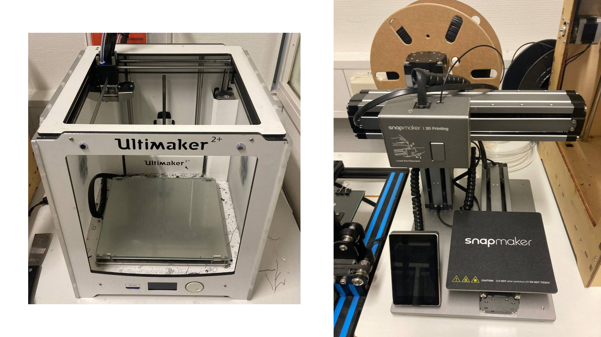

In the lecture part we first got introduced to the different types of 3D-printers namely SLA-, FDM-, SLS- and SPD-printers.

The process to a finished print generally starts from an idea and measures which is followed by 3D-modeling, the finished model then gets exported as a mesh, after that sliced to GCode which 3D-printers understand. GCode basically is the model sliced into a lot of layers which when printed ontop of each other build the model again.

## **Fused Deposition Modeling (FDM)**

FDM-printing is the cheapest way of 3D printing and this more common used in a private environment.
The quality and details of this type of printer is badder compared to other types of printers.
It works heating up Filament and depositting it through a nozzle onto a print-bed.

|  |
|:--:|
| *Ultimaker 2+ (Left), Snapmaker original (right)* |

|  |
|:--:|
| *Ultimaker 2+ printing* |

|  |
|:--:|
| *Finished print on the snapmaker original* |

## **Stereolithography (SLA) and Digital Light Procressing (DLP)**

SLA-printing uses a laser and a specific liquid (resin) to create 3D-structures. The Laser hits and because of that hardens the liquid only on the spots where a structure is supposed to be. This gets repeated layer for layer.

DLP-printing works similary to SLA-printing.

## **Selective Laser Sintering (SLS)**

For SLS-printing a powder is used which then gets hardend by a laser. It has pretty good mechanical properties and because of the powder no support structures for overhangs are needed. Unfortunately it only available for industry.

## **Selective Powder Deposition (SPD)**

SPD-printing works similary to SLS-printing, its also possible to print metals. Currently not very common.

## **CAD- vs. mesh-software**

Mesh-software should only be used to create 3D-models for organic sturctures like figurines because it does not offer the best dimensional accuracy.
With CAD-software on the other hand it is possible to create accurately measured 3D-models which is usefull if you need parts specifically sized.

# **Lab**

In the MI-Lab we have the following devices avilable:
 - Creality CR10 S5 with a 500 mm x 500 mm print-bed
 - ELEGOO MARS 2 Pro which is a SLA-printer
 - Snapmaker Original which is capable of printing, cnc-milling as well as laser engraving
 - Ultimaker Original and Ultimaker 2+

For slicing Ultimaker Original, Ultimaker 2+ as well as Creality CR10 S5 need Cura. The printer Snapmaker Original needs Snapmaker Luban for slicing and ELEGOO MARS 2 Pro needs Chitubox.

When creating 3D-models there is a variety of software available, for example Solidworks and Sketchup which are used by a lot of people, I personally really like to use Autodesk Fusion 360.
If you want to create more natural and shapes like figuriens Blender is a popular option to use.

## Problems while printing:

When printing a lot of problems can occur, I personally experienced a clogged nozzle, warping and bad overhangs.

TODO insert pictures (4.)