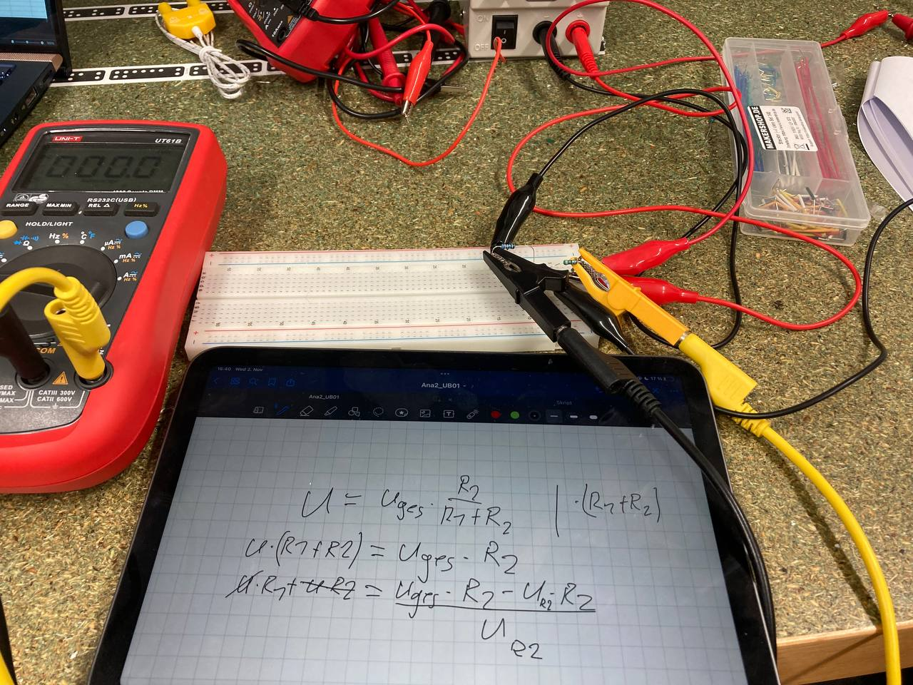
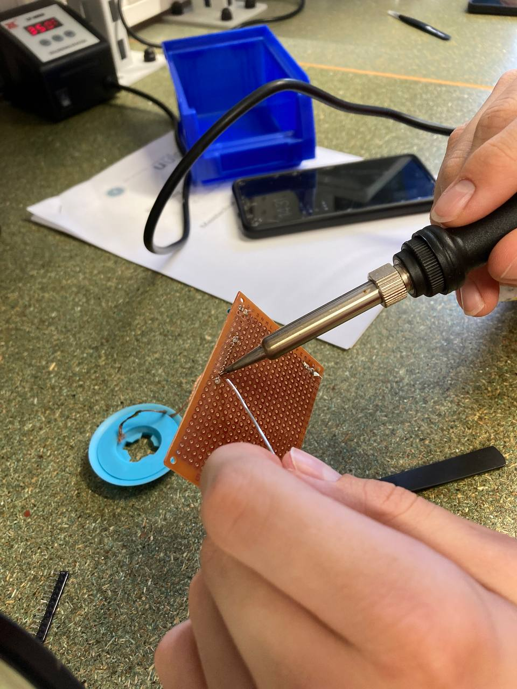
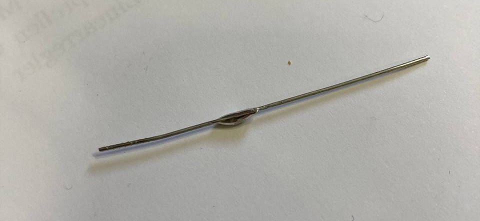
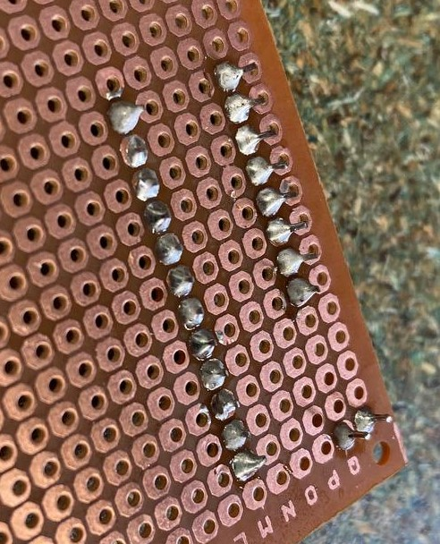
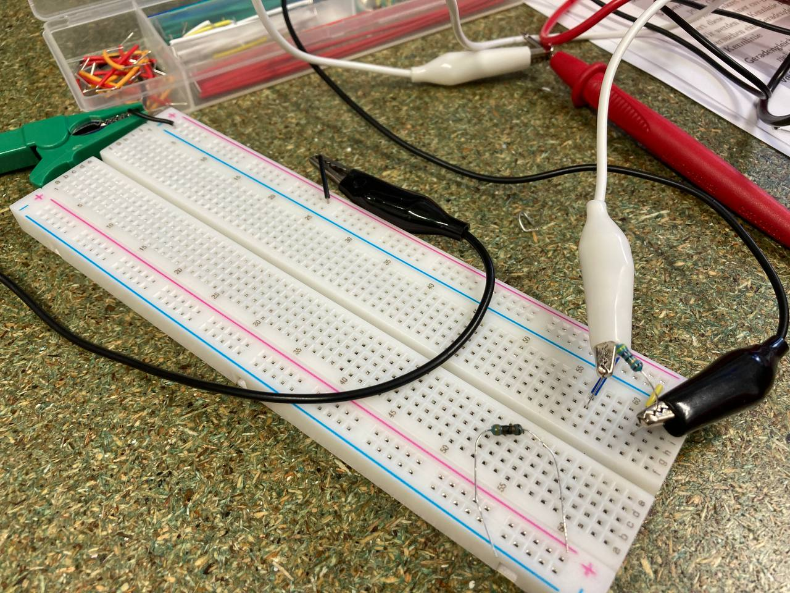
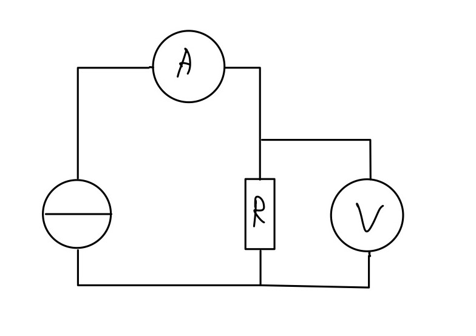
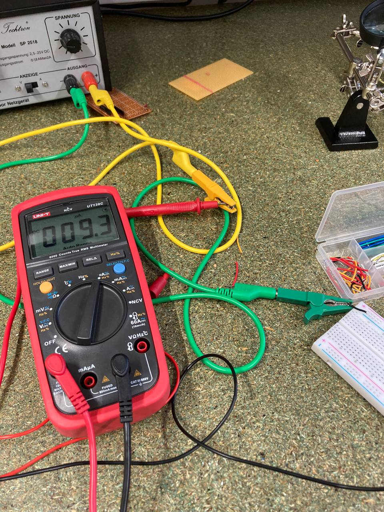

# Electrical Engineering

In the lecture part of the electrical engineering-lab we learned about the basic formulas and units of electrical engineering, how to use resistors and got introduced to some basic circuits like series- and parallel-circuits. We also got introduced in a lot of components which we might need later in our projects.

## Lab

In the lab part we then put some of the principles we learned to practise.

### Soldering

First we soldered some components which was nothing new to me but still entertaning since my soldering-iron at home isn't that advanced.

The row on the left and the two pins at the bottom are my soldering result.

### Circuit with voltag and current measurement

Next we built a small circuit and measured the voltage and current on it to calculate and plot the value of the resistor we used while changing the voltage.

As you can see in the picture above we accidentally burned a resistor.

The circuit was the following:

 - Voltage is measured in parallel
 - Current is measured in series

 In this picture you can see the multimeter measuring the current in series as well as the power supply in the back.
 Unfortunately we firstly plugged the multimeter wrong as you can see in the picture, we later realised it because we got wrong numbers in our plot of the resistance.

 

 This part was nothing new for me either because i had electrical engineering in school for 3 years and also measure stuff at home for own projects.