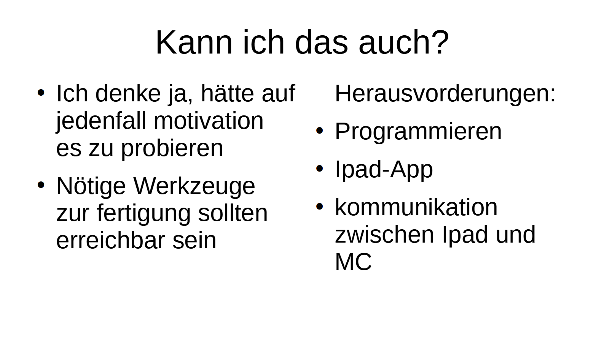

##

# Presentation of the exercise project

We had a small fair to present our projects. Everyone of us got a small space at a table with our posters behind it to present our project to interested people that were invited.

Everyone who came to my project was really interested and asked detailed questions about it, which made the overall presentation pretty enjoyable.

I remember the following questions:
 - Did I designed everything (laser-cutted and 3D-printed parts) for the project myself?

   Yes I did.

 - Did I use bluetooth or wifi to controll the car?

   Bluetooth.

 - Did i programm the bluetooth app myself?
   
   No I did not.

 - What was the most challenging part of my project?

   Definitely designing the steering mechanism. It involved a lot of measuring and several tries to print all the interlocking parts.

 - What the various electronic components in my project are responsible for.

    - ESP32 development board as a microcontorller
    - Servo for stearing
    - DC-motor for acceleration
    - Two 9V blocks for power
    - Voltage converter to get the 9V down to 5V for the microcontroller
    - Motor driver to controll the DC-motor

 - How many motors did I use?

   Two (Servo for steering and DC-motor for acceleration).

In general the feedback to my project was really positive and with some visitors I talked about further improvements I wanted to add to the car, like lights for example.

## Review of the semester

Looking back over the first semester of sketching with hardware I had a lot of fun in this module. I learned a lot of new things like mainly 3D-printing and laser-cutting and also gained a lot of experince in those two manufacturing preocesses through the exercise project.

In the fields electrical engineering, microcontrollers and mechanics, I already had a lot of knowledge beforehand but still learned some new things that were pretty interesting.

I think it would be pretty good to learn about the differnt manufacturing processes like 3D-printing and laser cutting a little earlier in the semester. That way it would be possible to start working on the exercise project earlier because for my project 3D-printing and laser-cutting needed the most time and intersected a little with my exam phase.

## Progress over the semester

In the beginning of the Semester we had to make a presetation about a DIY project which we thought would be interesting.

I took a project from [Stuff Made Here](https://www.youtube.com/@StuffMadeHere):



I wrote the following about, if I could do the project:

I think after this semester I definitely gained a lot of experience so that this project is even easier to implement.

Now I know how to use a 3D-printer, so the manufacturing process should be a lot easier then before the semester.
My exercise project didn't involved a lot of programming so that still would be a challenge but I also communicated with a apple device so there is a little progress as well.

## Next semester

I am really looking forward to the next semester and working on a bigger project with also a lot more time for it.

I don't really know yet what my project for the second semester will be but I think an autonomous driving car, or a app with which I can controll all the lights of my lego models would be interesting to make.
Another cool project would be to motorise the manual function of height adjusting my desk which would be controlled via wifi over a website to safe different prefered heights, etc.