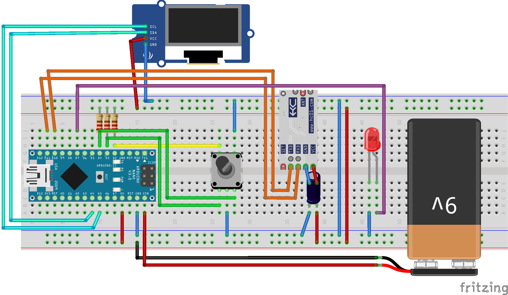

## Introducition

## Everything you need

For 3 bar-terminals you need the following:

### Parts
 - 3 x HC-12 radio module: [Amazon](https://www.amazon.de/dp/B07C92ZRS8?psc=1&ref=ppx_yo2ov_dt_b_product_details)
 - 3 x Arduino nano: [Amazon](https://www.amazon.de/-/en/AZDelivery-AZ-Nano-board-Atmega328-including/dp/B078SBBST6/ref=sr_1_3?crid=274FHDIZFJWDZ&keywords=arduino+nano+azdelivery&qid=1690021059&sprefix=arduino+nano+a%2Caps%2C81&sr=8-3)
 - 3 x 128x64 oled: [Amazon](https://www.amazon.de/-/en/dp/B074N9VLZX/ref=twister_B07ZQNB1HL?_encoding=UTF8&psc=1)
 - 3 x EC12 rotary encoder: [Amazon](https://www.amazon.de/dp/B08728PS6N?psc=1&ref=ppx_yo2ov_dt_b_product_details)
 - 3 x Red LEDs
 - 3 x 100yF Capacitor
 - 3 x Resistor (for LED - pulldown) 
 - 9 x Resistor (for Rotary encoder - pulldown)

### Hardware
 - filament for your 3D-printer
 - Solder (and if needed Flux)
 - Wires
 - hot-glue-sticks
 - 3 x breadboards like those: [Amazon](https://www.amazon.de/-/en/AZDelivery-AZ-Nano-board-Atmega328-including/dp/B078SBBST6/ref=sr_1_3?crid=274FHDIZFJWDZ&keywords=arduino+nano+azdelivery&qid=1690021059&sprefix=arduino+nano+a%2Caps%2C81&sr=8-3)
 - 3 x 9V Battery

### Tools

 - 3D Printer
 - Soldering Station/Iron
 - If needed helping hands for soldering or vise
 - Hot-glue-gun
 - Wire stripper
 - Pliers
 - Saw (Handsaw, Bandsaw or similar)

## Soldering

In the following image you can see how everything is supposed to be wired up.
I always used 70mm long wires for soldering.

//verbindungsdiagramm

## 3D-printing

//druckdateien

## Assembly

## Code

## Finished!

//licensec  https://creativecommons.org/licenses/?lang=de