This post features the instruction for my bar terminals.

**Note:** You can also find all files for the project [here](project.zip).

## Introduction

With this instruction, I will show you how to build yourself (bar-) terminals, that use radio signals to send each other predefined messages.

The terminal allows you to select a message and send it to a selected other terminal and displays receive messages on an oled. If a message is received a LED turns on to indicate the received message.

The messages are sent via a radio signal and the terminals are implemented as a really simplified mesh-network so each terminal receives the message and if the message is not meant for the terminal it forwards the message. This also allows to bridge longer distances than the radio signal can reach.

If you want to read more about the project you can check out this [post]().

## Everything you need

For 3 bar-terminals you need the following:

### Parts
 - 3 x HC-12 radio module: [Amazon](https://www.amazon.de/dp/B07C92ZRS8?psc=1&ref=ppx_yo2ov_dt_b_product_details)
 - 3 x Arduino Nano: [Amazon](https://www.amazon.de/-/en/AZDelivery-AZ-Nano-board-Atmega328-including/dp/B078SBBST6/ref=sr_1_3?crid=274FHDIZFJWDZ&keywords=arduino+nano+azdelivery&qid=1690021059&sprefix=arduino+nano+a%2Caps%2C81&sr=8-3)
 - 3 x 128x64 oled: [Amazon](https://www.amazon.de/-/en/dp/B074N9VLZX/ref=twister_B07ZQNB1HL?_encoding=UTF8&psc=1)
 - 3 x EC12 rotary encoder: [Amazon](https://www.amazon.de/dp/B08728PS6N?psc=1&ref=ppx_yo2ov_dt_b_product_details)
 - 3 x Red LEDs (5mm)
 - 3 x 100 µF Capacitor
 - 3 x 220 Ω Resistor (for LED - pulldown) 
 - 9 x 10 kΩ Resistor (for Rotary encoder - pulldown)

### Hardware
 - filament for your 3D-printer
 - Solder (and if needed Flux)
 - Wires
 - shrink tubing
 - hot-glue-sticks
 - 3 x pcb like those: [Amazon](https://www.amazon.de/AZDelivery-Lochrasterplatte-Lochrasterplatine-Leiterplatte-Arduino/dp/B078HV79XX/ref=sr_1_7?keywords=pcb&qid=1690202302&sr=8-7)
 - 3 x 9V Battery
 - 3 x Battery clips 9V like those: [Amazon](https://www.amazon.de/Hailege-Battery-I-Type-Leather-Connector/dp/B0BGPG3NCY/ref=sr_1_3?__mk_de_DE=%C3%85M%C3%85%C5%BD%C3%95%C3%91&crid=2YH9ST3W72W7O&keywords=9v+clips&qid=1690198264&sprefix=9v+clips%2Caps%2C97&sr=8-3)

### Tools

 - 3D Printer
 - Soldering Station/Iron
 - If needed: helping hands for soldering or a vise as misused helping hands :D
 - Hot-glue-gun
 - Wire stripper
 - Pliers
 - Saw (Handsaw, Bandsaw or similar)

## Soldering

In the following image, you can see how everything is supposed to be wired up.
I **always** used 70mm long wires for soldering.

|  |
| :-: |
| *soldering diagram* |

1. Because the space is limited you need to cut the pcbs to the desired size of 18x11 holes.

2. To connect more holes I used a short wire and soldered it to each hole and the pin of the Arduino.

   | 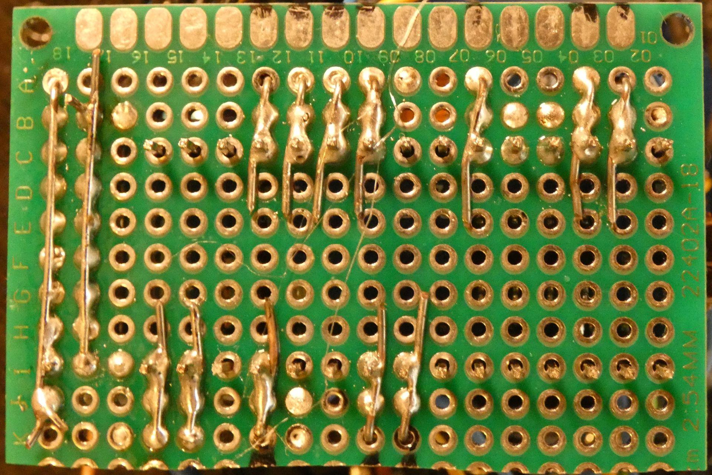 | 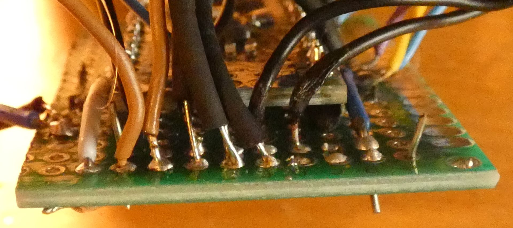 |
   | :-: | :-: |
   | *cutted pcb with connection of holes* | *5V and gnd line from top* |

3. As you can see I only soldered the pins of the Arduino, that I needed.
   On the left picture on the left-hand side you can see the gnd and 5V line from the bottom. 
   The next step would be to connect the gnd-arduino-pin with the gnd line and the 5V pin with the 5V line.
   | 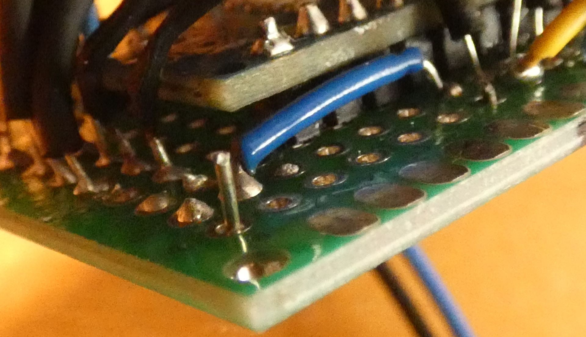 | 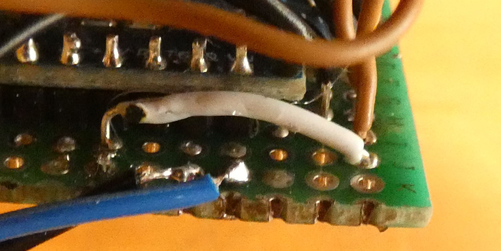 |
   | :-: | :-: |
   | *gnd connection* | *5V-connection* |

4. VIN and gnd-wire for the external power source
   |  |
   | :-: |
   | *blue: VIN-wire, black: gnd-wire* |

   If you directly solder the 9V Battery clips onto the pcb it would be black on gnd and red on VIN.

5. Next you should solder the radio-module.
   1. Solder the 100 µF Capacitor onto the module. :warning: be careful so that the white side of the capacitor is connected to the gnd pin of the radio-module
   
   2. Now solder all 4 wires to the radio-module.

   3. In the last step you solder the wires from the radio module to your pcb, start with gnd then 5V and then the two data wires.
      |  |
      | :-: |
      | *radio-module with capacitor* |

6. After the radio module continue with soldering the oled-screen.
   Again, first solder the wires to the screen and then to the pcb.
   On the pcb start with gnd, then 5V, then the data wires.

7. Now the LED follows.
   First solder the 220 Ω Resistor onto the short leg (cut side) of the LED.
   This site also goes onto your gnd line on the pcb.
   After that solder the other leg of the LED onto the data pin.

8. Next is the rotary encoder:
   1. First solder all the wires onto the rotary encoder and then the two gnd wires onto the gnd-line on the pcb.
   
   2. After that, solder the three 10 kΩ Resistors onto the 5V-line and then onto the three data pins.
      To prevent short circuits use shrink tubing around the resistors and only leave a small part of the wire unprotected.
      |  |
      | :-: |
      | *10 kΩ Resistors with shrink tubing* |

   3. To finish solder the data wires onto the pcb.
   
9.  Congratulations you finished soldering everything!
   It should look somewhat like this:
   
   | 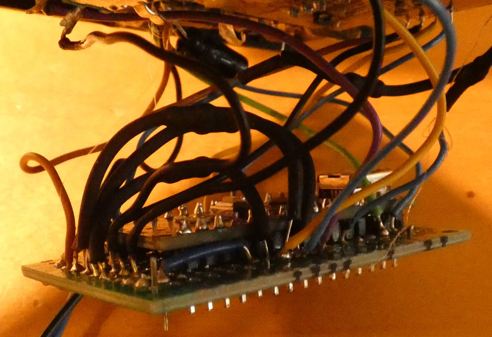 | 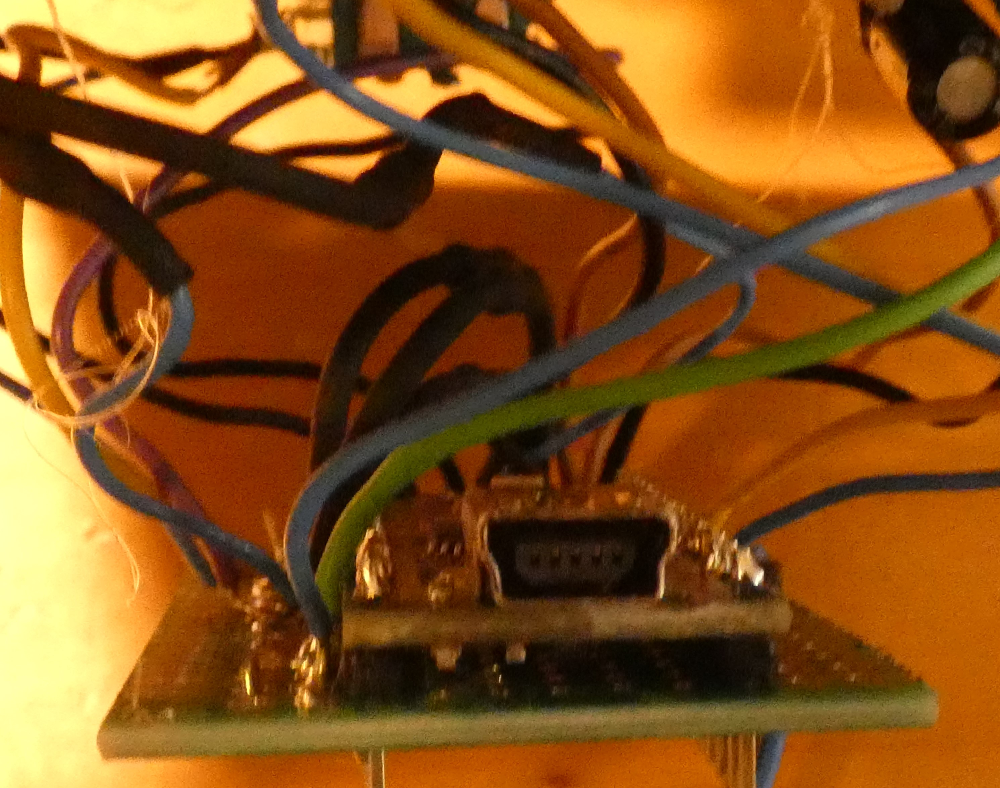 | 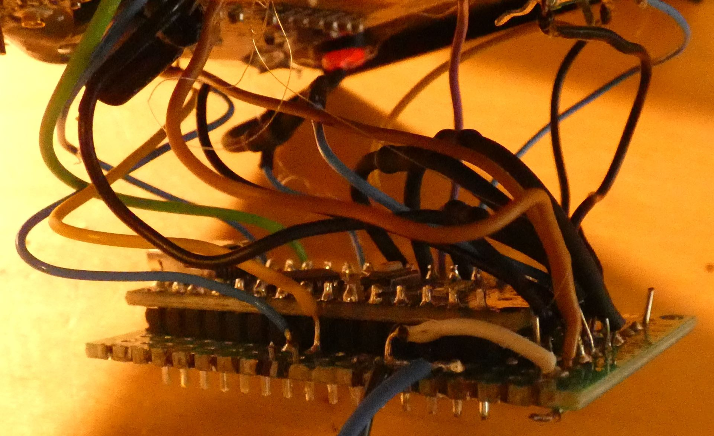 |
   | :-: | :-: | :-: |
   | *left* | *front* | *right* |

## Code

I used visual-studio-code with the platform.io extension to write my program.
In the zip folder, you can download, you can also find a complete **platform.io project**.

I used the SSD1306Ascii library which is pretty resource-saving, so the ram of the nano is only 50% full.

The code is completely commented and should be self-explaining.
The basic thoughts behind the menu-system are bools to check if screens are active or not and the cursor just overwrites a defined position on the screen if the rotary encoder is turned in either direction.

The terminal just sends a string with 4 numbers which the other terminals then evaluate.

To use this code for more than one terminal you just have to change lines 51 and 52 in the code.

```C++
String fromBar = "1"; //change this to the according terminal number
String barName = "Caipibar (Bar 1)"; //change this to the according 
```

The whole Arduino-sketch:

``` C++
#include <Arduino.h> //only for platform.io
#include <Wire.h>
#include "SSD1306Ascii.h"
#include "SSD1306AsciiWire.h"
#include <SoftwareSerial.h>

//BAR/Terminal 1 !!!

// Header: to whom?, from who, message, forward-bit

#define I2C_ADDRESS 0x3C

// Rotary Encoder Inputs
#define CLK 2
#define DT 3
#define SW 4

//LED
#define LED 7

//HC12
SoftwareSerial hc12(10,11);

//OLED
SSD1306AsciiWire oled;

//Encoder
int counter = 0;
int counterTemp = 0;
int currentStateCLK;
int lastStateCLK;
String currentDir ="";

//Button
unsigned long lastButtonPress = 0;
int isPressed = false;

//Bools for screens
bool startScreenBool;
bool messageScreenBool;
bool barScreenBool;

//Bools for Cursor
bool cursorBackBool;
bool cursor4Bool;
bool cursor5Bool;
bool cursor6Bool;

//Variables for send message (header)
String toBar;
String fromBar = "1"; //change this to the according terminal number
String barName = "Caipibar (Bar 1)"; //change this to the according terminal number and name
String toMessage;
String forwardBit = "0";

//Variables for recieved Message
String recievedPayload;
String recievedForwardBit = "1";
bool recievedMessage;

//functions (because of platform.io)
void startScreen();
void messageScreen();
void barScreen();

void menueMessageScreen();
void menueBarScreen();

void setCursorBack();
void setCursor4();
void setCursor5();
void setCursor6();

void clearCursors();

void readRecievedPayload(String recievedPayload);

void printRecievedMessage(int fromBar, int message);

void sendMessage();

//SetupFunction
void setup() {
  //Start radio-module
  hc12.begin(9600);

  //Set LED pin as output
  pinMode(LED, OUTPUT);

	// Set encoder pins as inputs
	pinMode(CLK,INPUT);
	pinMode(DT,INPUT);
	pinMode(SW, INPUT_PULLUP);

	// Setup Serial Monitor
	Serial.begin(9600);

	// Read the initial state of CLK
	lastStateCLK = digitalRead(CLK);

  //Setup oled-screen
  Wire.begin();
  Wire.setClock(400000L);
  oled.begin(&SH1106_128x64, I2C_ADDRESS);
  oled.setFont(System5x7);
  startScreen();
}

//loop function
void loop() {

//----------------handle recieved messages-----------------------|

  if (startScreenBool) { //if on startscreen
    if(hc12.available()) {
      recievedPayload = hc12.readString(); //read the recieved message

      // split the message
      int msgToBar = recievedPayload.substring(0, 1).toInt();
      int msgFromBar = recievedPayload.substring(1, 2).toInt();
      int msg = recievedPayload.substring(2, 3).toInt();
      int msgForwardBit = recievedPayload.substring(3).toInt();

      if (msgToBar == fromBar.toInt()) { //checks if message is for this terminal
        digitalWrite(LED, HIGH);
        recievedMessage = true;
        readRecievedPayload(recievedPayload);
      } else if(msgToBar == toBar.toInt() && msgFromBar == fromBar.toInt() && msg == toMessage.toInt()) { //checks if its the own message
        Serial.println("Meine eigene nachricht");
      } else if(msgForwardBit == recievedForwardBit.toInt()) { //checks if message already forwarded
        recievedForwardBit = "1";
        Serial.println("Nachricht schon mal forwarded");  
      } else {                                    //forward message
        recievedForwardBit = msgForwardBit;
        hc12.print(recievedPayload);
        Serial.println("Message forwarded");
      }
    }
  }

  //---------------------------------encoder---------------------------|
	// Read the current state of CLK
	currentStateCLK = digitalRead(CLK);

	// If last and current state of CLK are different, then pulse occurred
	// React to only 1 state change to avoid double count
	if (currentStateCLK != lastStateCLK  && currentStateCLK == 1){

		// If the DT state is different than the CLK state then
		// the encoder is rotating CCW so decrement
		if (digitalRead(DT) != currentStateCLK) {
			counter --;
			currentDir ="CCW";

      if (messageScreenBool || barScreenBool) { //if either on message-selection-screen or on bar-selection-screen
        if (!cursorBackBool && !cursor4Bool && !cursor5Bool && !cursor6Bool) setCursorBack(); //checks if no cursor is set
        else if (cursorBackBool) setCursor4();
        else if (cursor4Bool) setCursor5();
        else if (cursor5Bool) setCursor6();
        else if (cursor6Bool) setCursorBack();
      }


		} else {
			// Encoder is rotating CW so increment
			counter ++;
			currentDir ="CW";

      if (messageScreenBool || barScreenBool) { //if either on message-selection-screen or on bar-selection-screen
        if (!cursorBackBool && !cursor4Bool && !cursor5Bool && !cursor6Bool) setCursorBack(); //checks if no cursor is set
        else if (cursorBackBool) setCursor6();
        else if (cursor6Bool) setCursor5();
        else if (cursor5Bool) setCursor4();
        else if (cursor4Bool) setCursorBack();
      }


		}

		Serial.print("Direction: ");
		Serial.print(currentDir);
		Serial.print(" | Counter: ");
		Serial.println(counter);
	}

	// Remember last CLK state
	lastStateCLK = currentStateCLK;


  //-------------------Button--------------------|
	// Read the button state
	int btnState = digitalRead(SW);

	//If we detect LOW signal, button is pressed
	if (btnState == LOW) {
		//if 50ms have passed since last LOW pulse, it means that the
		//button has been pressed, released and pressed again
		if (millis() - lastButtonPress > 50) {
			Serial.println("Button pressed!");

      if (recievedMessage == true) { //turns of LED if message was read after recieved and removes message from startscreen
        startScreen();
      } else if (!messageScreenBool && !barScreenBool && recievedMessage == false) messageScreen(); //switches to message-selection-screen if messageScreen AND barScreen not active AND no message recieved

      //message-selection-screen, decides when to switch to bar screen
      if (cursorBackBool && !barScreenBool) { //switches from message-selection-screen to startscreen
        startScreen();
      } else if (cursor4Bool && !barScreenBool) { //switches to barScreen if cursor on msg1 and NOT in barScreen
        barScreen();
        toMessage = "1";
      } else if (cursor5Bool && !barScreenBool) {
        barScreen();
        toMessage = "2";
      } else if (cursor6Bool && !barScreenBool) {
        barScreen();
        toMessage = "3";
      }

      //bar-seleciton screen, decides when to switch back to startscreen over the sendMessage function
      if (cursorBackBool && !messageScreenBool) { //switches from bar-seleciton screen to message-selection-screen
        messageScreen();
      } else if (cursor4Bool && !messageScreenBool) {
        toBar = "1";
        sendMessage();
      } else if (cursor5Bool && !messageScreenBool) {
        toBar = "2";
        sendMessage();
      } else if (cursor6Bool && !messageScreenBool) {
        toBar = "3";
        sendMessage();
      }
		}

		// Remember last button press event
		lastButtonPress = millis();
	}

	// Put in a slight delay to help debounce the reading
	delay(1);
}

//<---------Screen functions---------------->
void startScreen() {
  startScreenBool = true;
  messageScreenBool = false;
  barScreenBool = false;
  digitalWrite(LED, LOW);
  recievedMessage = false;
  clearCursors();
  oled.clear();
  oled.setRow(0);
  oled.println(barName);
  oled.setRow(2);
  oled.println("Press button to send");
  oled.setRow(3);
  oled.println("a message!");
  oled.setRow(4);
  oled.println("                             ");
  oled.setRow(5);
  oled.println("                             ");
  oled.setRow(6);
  oled.println("                             ");
  oled.setRow(7);
  oled.println("                             ");
}

void messageScreen() {
  startScreenBool = false;
  messageScreenBool = true;
  barScreenBool = false;
  digitalWrite(LED, LOW);
  recievedMessage = false;
  clearCursors();
  oled.clear();
  menueMessageScreen();
}

void barScreen() {
  startScreenBool = false;
  messageScreenBool = false;
  barScreenBool = true;
  digitalWrite(LED, LOW);
  recievedMessage = false;
  clearCursors();
  oled.clear();
  menueBarScreen();
}

//<---------Menue functions-------------->

void menueMessageScreen() {
  //Heading
  oled.println("Choose a message!");
  //Back Button
  oled.setRow(2);
  oled.println("  Back to start");
  //Messages
  oled.setRow(4);
  oled.println("  need helpers");
  oled.setRow(5);
  oled.println("  need glasses");
  oled.setRow(6);
  oled.println("  need change");
  //Cursor
}

void menueBarScreen() {
  //Heading
  oled.println("Choose a bar!");
  //Back Button
  oled.setRow(2);
  oled.println("  Back to messages");
  //Messages
  oled.setRow(4);
  oled.println("  Caipibar");
  oled.setRow(5);
  oled.println("  Shotbar");
  oled.setRow(6);
  oled.println("  Bierbar");
  //Cursor
}

//<---------------other functions------------------->
void readRecievedPayload(String recievedPayload) { //splits the recieved message
  int fromBar = recievedPayload.substring(1,2).toInt();
  int message = recievedPayload.substring(2,3).toInt();
  printRecievedMessage(fromBar, message);
}

void printRecievedMessage(int fromBar, int message) { //prints the recieved message
  String FromBar;
  String Message;

  if (fromBar == 1) FromBar = "Caipibar ";
  else if (fromBar == 2) FromBar = "Shotbar ";
  else if (fromBar == 3) FromBar = "Bierbar ";

  if (message == 1) Message = "needs helpers!";
  else if (message == 2) Message = "needs glasses!";
  else if (message == 3) Message = "needs change.";

  String printMessage = FromBar + Message;
  oled.setRow(5);
  oled.println("Recieved a message:");
  oled.setRow(6);
  oled.println("                             ");
  oled.setRow(7);
  oled.println(printMessage);
}

void sendMessage() { //sends the Message, switches to startscreen and shows succesfull send
  String msg = toBar + fromBar + toMessage + forwardBit;
  hc12.print(msg);
  startScreen();
  oled.setRow(5);
  oled.println("Message send");
  oled.setRow(6);
  oled.println("succesfully!");
  oled.setRow(7);
  oled.println("                             ");
}

//<------------------Set Cursor Functions---------------->
void setCursorBack() {
  cursorBackBool = true;
  oled.setRow(2);
  oled.setCol(0);
  oled.print("<");
  cursor4Bool = false;
  oled.setRow(4);
  oled.setCol(0);
  oled.print(" ");
  cursor5Bool = false;
  oled.setRow(5);
  oled.setCol(0);
  oled.println(" ");
  cursor6Bool = false;
  oled.setRow(6);
  oled.setCol(0);
  oled.println(" ");
}

void setCursor4() {
  cursorBackBool = false;
  oled.setRow(2);
  oled.setCol(0);
  oled.print(" ");
  cursor4Bool = true;
  oled.setRow(4);
  oled.setCol(0);
  oled.print(">");
  cursor5Bool = false;
  oled.setRow(5);
  oled.setCol(0);
  oled.println(" ");
  cursor6Bool = false;
  oled.setRow(6);
  oled.setCol(0);
  oled.println(" ");
}

void setCursor5() {
  cursorBackBool = false;
  oled.setRow(2);
  oled.setCol(0);
  oled.print(" ");
  cursor4Bool = false;
  oled.setRow(4);
  oled.setCol(0);
  oled.print(" ");
  cursor5Bool = true;
  oled.setRow(5);
  oled.setCol(0);
  oled.println(">");
  cursor6Bool = false;
  oled.setRow(6);
  oled.setCol(0);
  oled.println(" ");
}

void setCursor6() {
  cursorBackBool = false;
  oled.setRow(2);
  oled.setCol(0);
  oled.print(" ");
  cursor4Bool = false;
  oled.setRow(4);
  oled.setCol(0);
  oled.print(" ");
  cursor5Bool = false;
  oled.setRow(5);
  oled.setCol(0);
  oled.println(" ");
  cursor6Bool = true;
  oled.setRow(6);
  oled.setCol(0);
  oled.println(">");
}

void clearCursors() {
  cursorBackBool = false;
  cursor4Bool = false;
  cursor5Bool = false;
  cursor6Bool = false;
}
```

## 3D-printing

Now you need to print the housing of the terminal.
It consists of two parts, the box and the cover.

The measurements of my housing are made for a specific cash register we use at our uni-partys, if you want to fit the terminal into your cash register you probably have to take the measurements by yourself and design your box.

For printing you don't need a support structure!

### cover

| 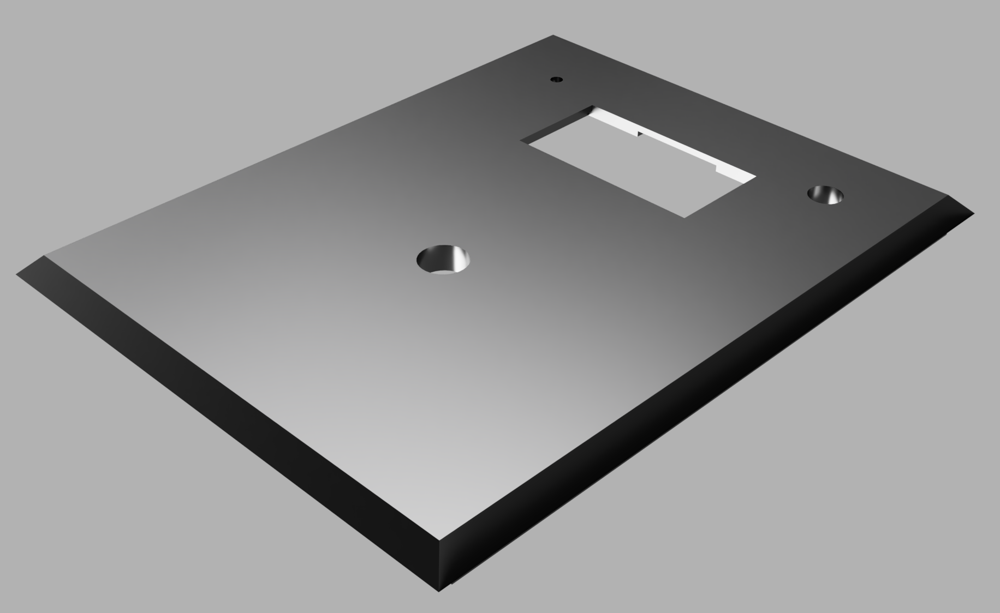 | 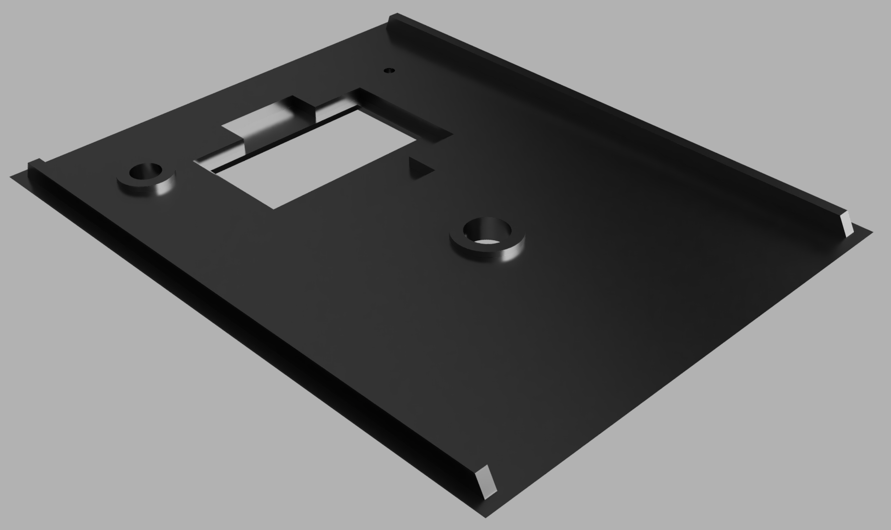 |
| :-: | :-: |
| *Top* | *Bottom* |

The cover has four openings as you can see in the "Top"-image:
 - in the Back: small hole for the antenna
 - right-hand side: hole for the LED
 - in between those two holes: opening for the oled-screen
 - in the middle of the picture: hole for the rotary encoder

Some measurements so you don't have to get them again:
 - hole antenna: 2 mm diameter
 - hole LED: 9 mm diameter
 - hole rotary encoder: 11 mm diameter
 - oled display size: 31 x 16 mm
 - oled notch like seen in the "Bottom"-image:
   | 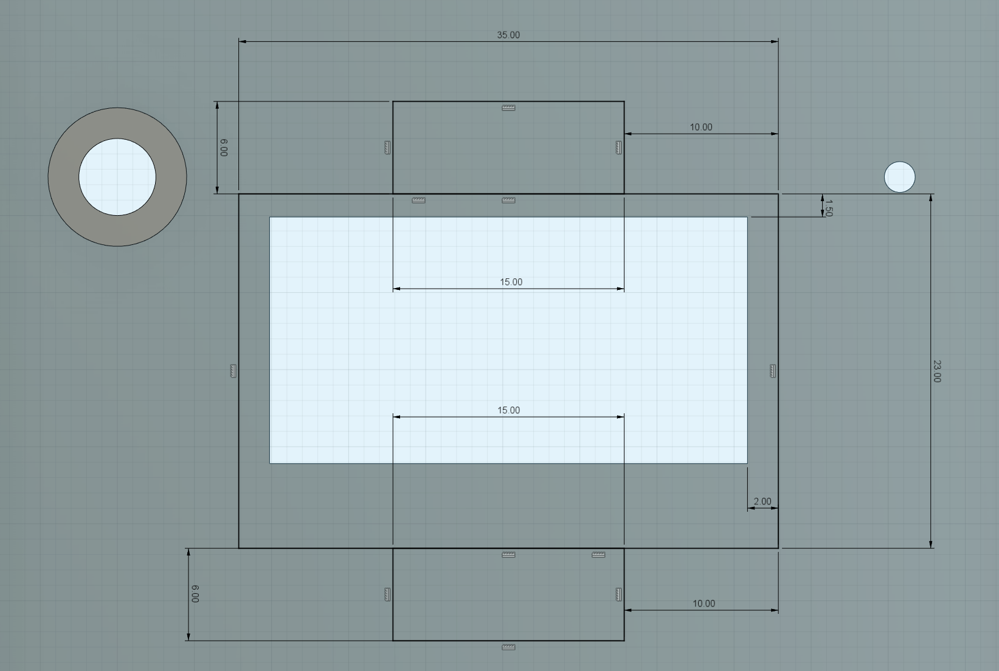 |
   | :-: |
   | *notch measurements* |

[Download coverV2.stl](coverV2.stl)

### box

| 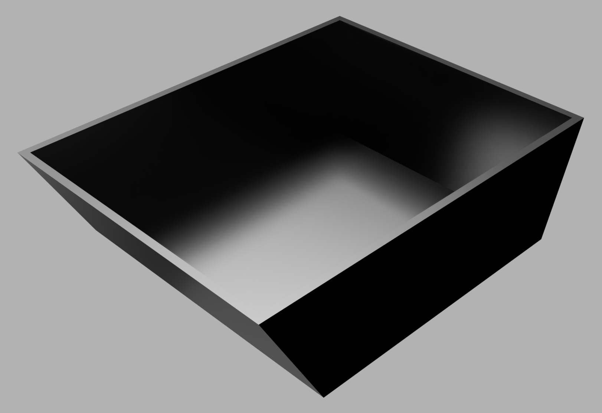 |
| :-: |
| *box* |

There is not much to say about the box.

[Download box.stl](box.stl)

## Assembly

Basically, you just glue everything to the cover and put the cover on the box.

1. Start with putting the rotary-encoder through the specified hole and fix it with the included screw
   |  |
   | :-: |
   | *attachment rotary encoder* |

2. Radio-module

   Now follows the tricky party put the antenna of the radio module from the top through the specified hole of the cover and then solder the radio-module onto it from the bottom side of the cover.

   After that fix the radio module with hot-glue onto the cover.
   | 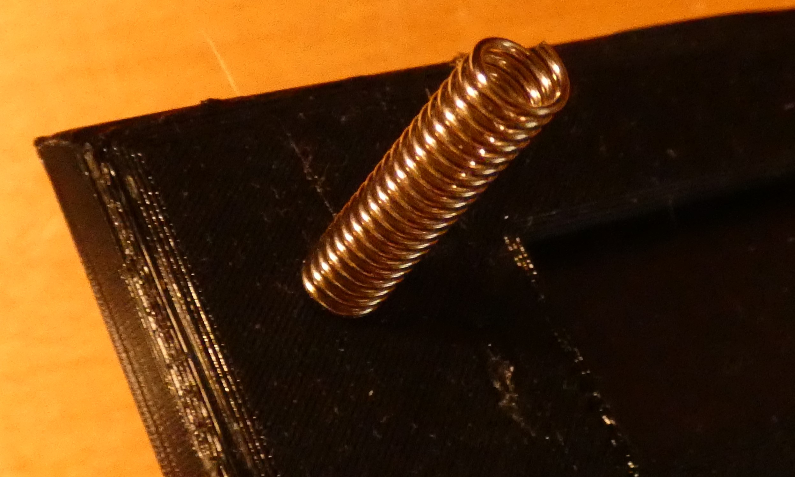 |  |
   | :-: | :-: |
   | *antenna* | *glued radio-module* |

3. Screen and LED
   
   Now fix the Screen and LED with hot glue onto the cover.
   |  |
   | :-: |
   | *oled and LED fixed with hot-glue* |

4. Finished cover
   
   The cover should look like this now:
   | 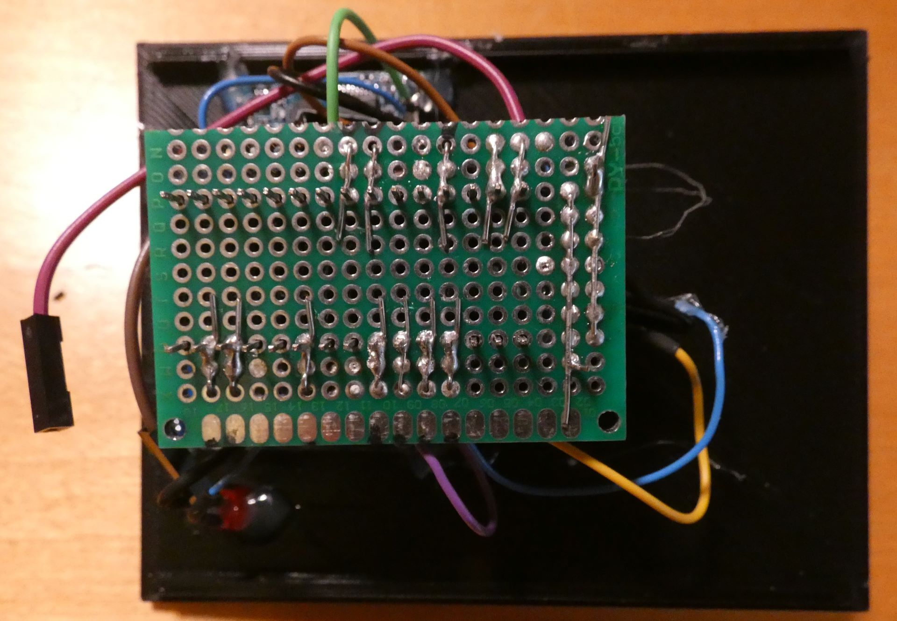 | 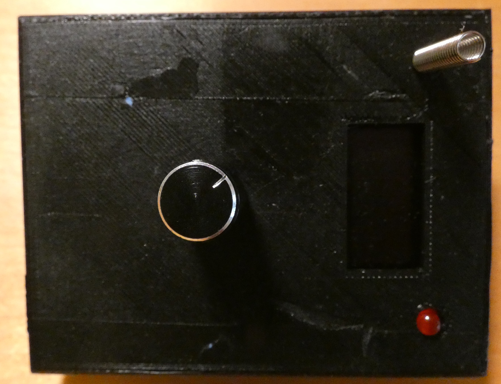 |
   | :-: | :-: |
   | *bottom* | *top* |

5. Put the cover on the box
   After you glued everything to the cover you just need to add a 9V-Block as a power source, here a switch to cut the power would be useful, which unfortunately is not yet included.

## Finished!

Congratulations you finished the project!

| 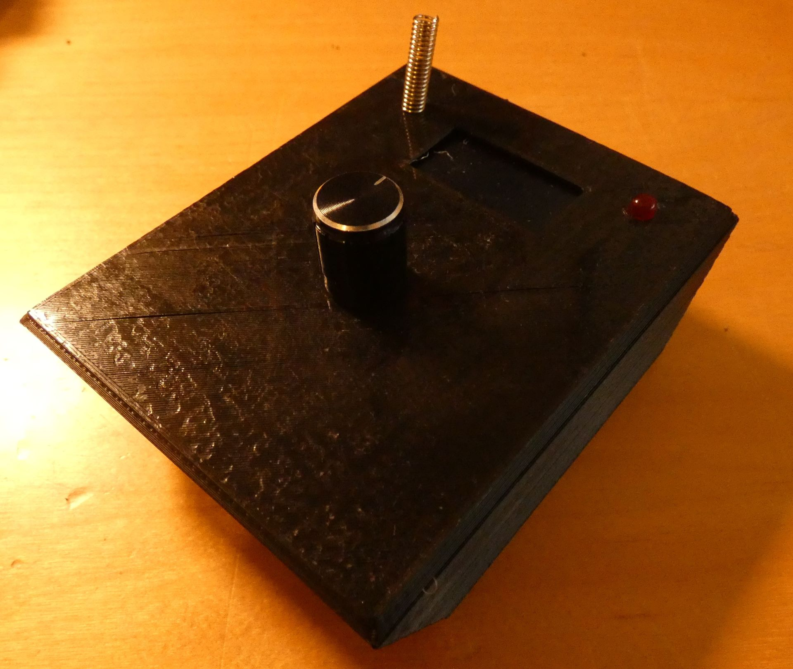 |
| :-: |
| *Finished terminal* |

Again, [here](project.zip) you can download everything you need for the project as a zip-file.

### License

<a rel="license" href="http://creativecommons.org/licenses/by-nc/4.0/"></a><br />This work is licensed under a <a rel="license" href="http://creativecommons.org/licenses/by-nc/4.0/">Creative Commons Attribution-NonCommercial 4.0 International License</a>.