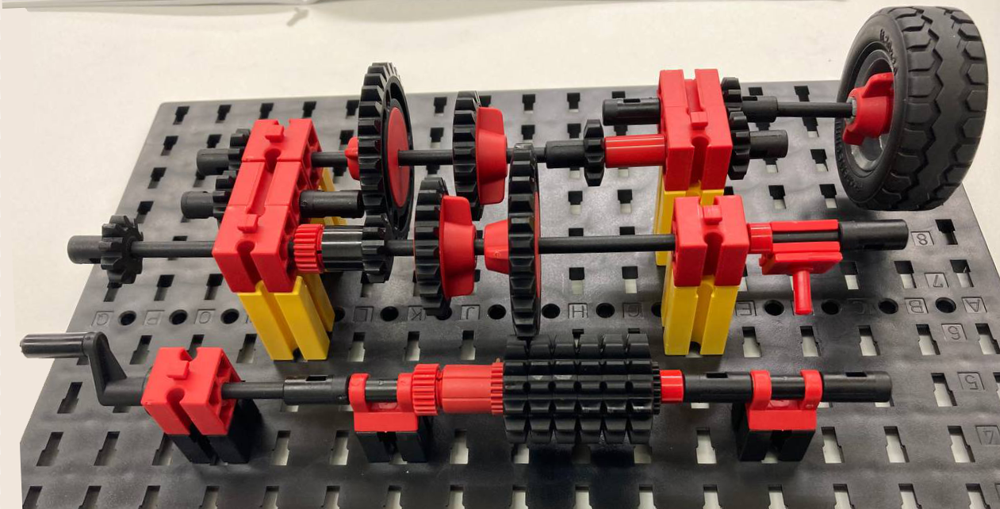
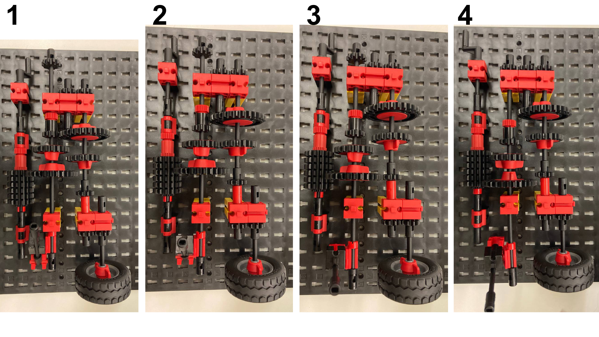
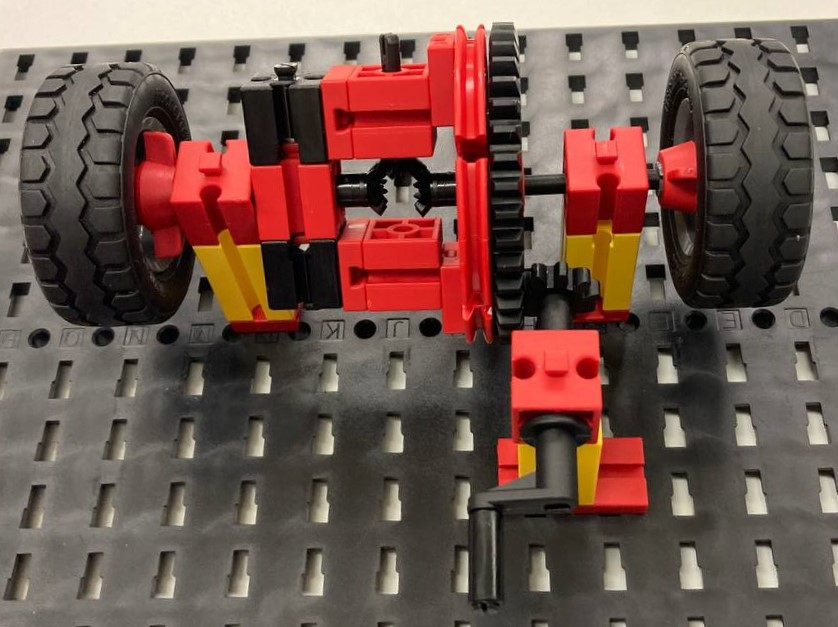
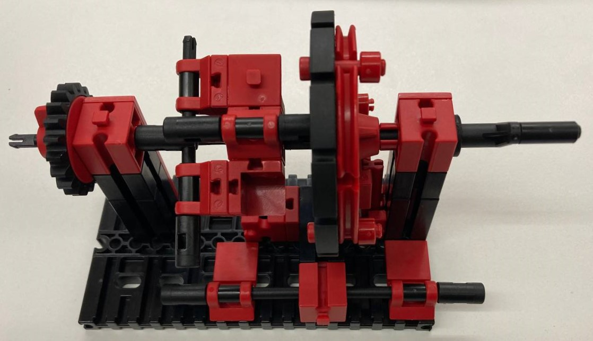

In the lecture part of mechanics we learnd a little bit about the physical basics and some important formulas regarding them. We got introduced to levers, pulleys, wheels and axles as well as screws and gears. After that the basic functionality of motors got explained and how a dc-motor transforms electrial energy into a rotation. Servo motors and stepper-motors were presented as well.
In the robotics part we learned about different kinds of linkages and the resulting kinematics out of linkages. In the end we got introduced to the concept of soft robotics inspired by nature and how to unterstand mechanisms.

# **Lab**

In the lab part we then explored some mechanisms with a "Fischertechnik-Baukasten".

## **Push crank**

First we build a push crank, which transforms a rotational motion into a linear motion.

## **Manual gearbox with 3 gears**

After the push crank we had to build a manual gearbox with 3 gears.

In the picture below you can see the 3 different gears and the reverse gear.

The gears get switched by putting the lever which you can see the best in picture 4 in different positions.

The crank in the top left corner is used to drive the gearbox

   1. The small gearwheel drives the bigger one, which results in a slower speed.
   2. Two same sized gearwheels are used, the speed stays the same and isn't translated.
   3. A big gearwheel drives a smaller one, which results in a higher speed.
   4. A third gear is added which results in reversing the direction in which the wheel spins and equals a reverse gear.

## **Differential gear**

A differential gear is used to equalize the speed between two parallel tires. This happens when a car drives a curve, because then the inner tire will cover a smaller distance than the outer tire because the radius is smaller.

## **Planetary gear**

A planetary gear is basically used like a gearbox and translates speeds as well.
You can find it for example in a hub transmission in a bike or to gear vehicles like tractors additionally down.

