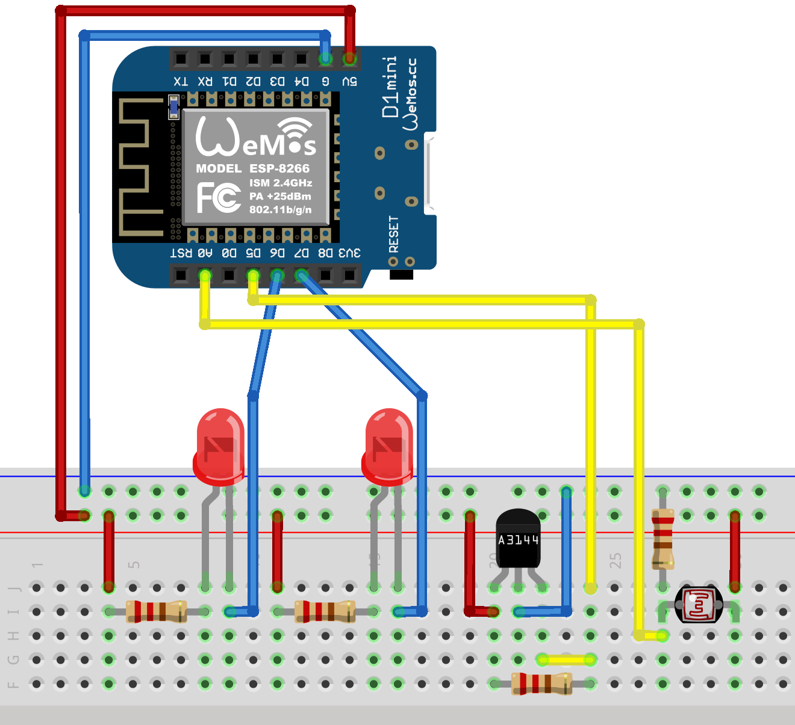
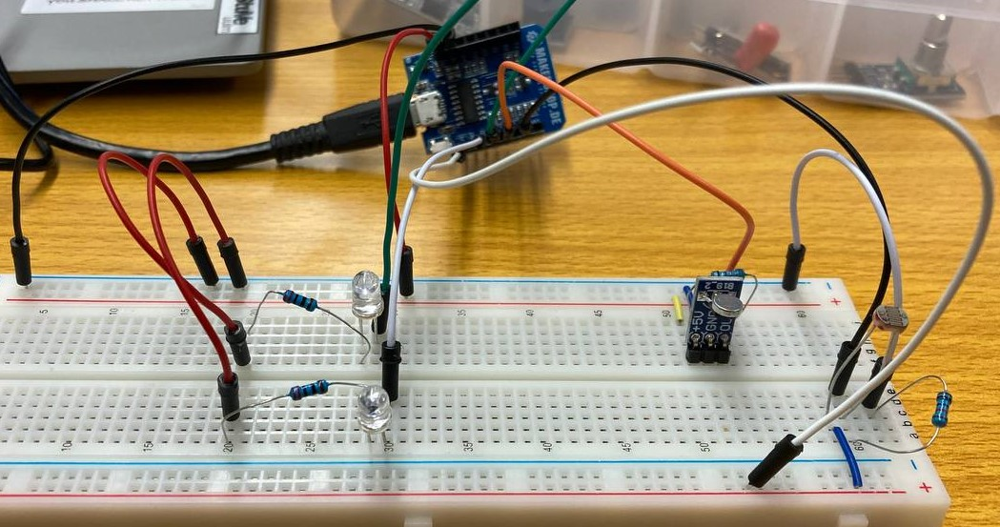
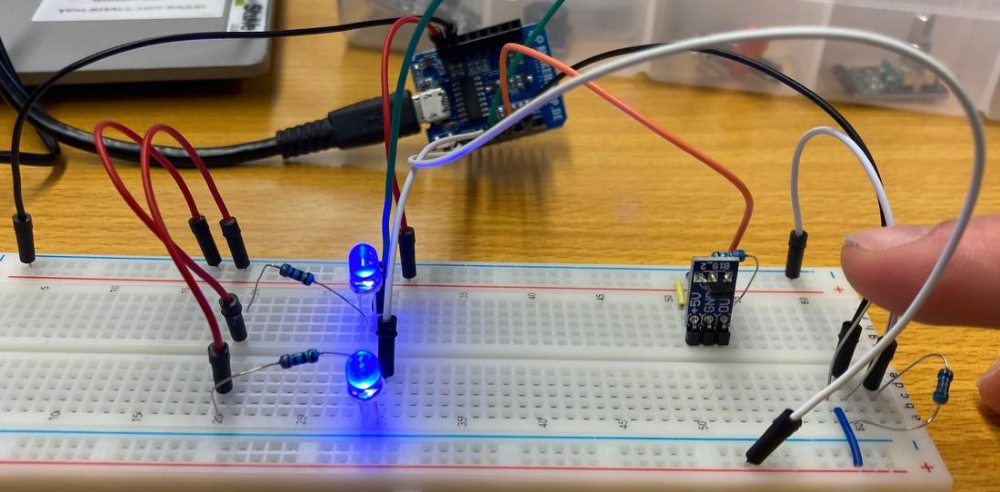
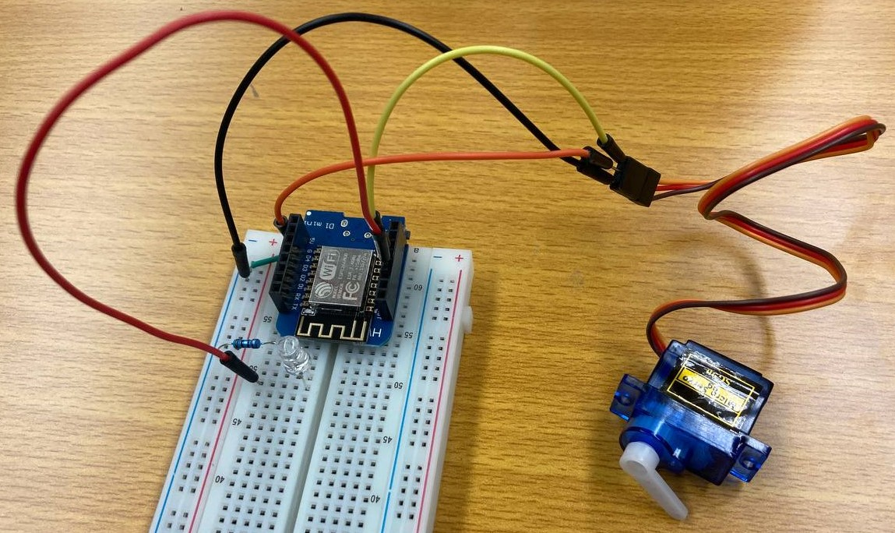

In the lecture parts of microcontrollers we got introduced to the Arduino-Ecosystem of boards and shields. Then we learned about board features, as well as the Arduino IDE and the basics of Serial Communication.

# **Lab**

In the lab part we then experimented hands-on with microctontrollers and different sensors, to get a feeling for everything.

## **Week 1: Controlling LEDs with a Hall-Sensor and a LDR-Sensor, PlatformIO**

In the first lab I tried some different sensors by controlling the LED-state with them and switched from the Arduino IDE to PlatformIO, a Visual Studio Code extension for working with Arduino, as well as ESP-Boards.

**Hall- and LDR-Sensor:**

A Hall-Sensor reacts to a megnetic field which then can be read by a microcontroller. The LDR-Sensor works similar only that it reacts to a change of brightness instead to a magnetic field.

Circuit:



Resistors for the LEDs: 220 ohm <br>
Resistor for the Hall-Sensor: 10k ohm

Code:

``` C++
#define PIN_HALL_SENSOR 14 //Hall-Sensor
#define PIN_LED1 12

#define PIN_PHOTO_RESISTOR A0 //LDR-Sensor
#define PIN_LED2 13

int brightness = 0;

void setup()
{
    pinMode(PIN_HALL_SENSOR, INPUT);
    pinMode(PIN_LED1, OUTPUT);
    pinMode(PIN_LED2, OUTPUT);
    Serial.begin(9600);

}

void loop()
{
    //Set LED to read value of LDR-Sensor
    digitalWrite(PIN_LED1, digitalRead(PIN_HALL_SENSOR));
    brightness = analogRead(PIN_PHOTO_RESISTOR);
    
    Serial.println("Hall: ");
    Serial.println(digitalRead(PIN_HALL_SENSOR));

    Serial.println("LDR: ");
    Serial.println(brightness);

    if (brightness < 600)
    {
      digitalWrite(PIN_LED2, HIGH);
    } else 
    {
      digitalWrite(PIN_LED2, LOW);
    }   
}
```
<br>
Magnet on Hall-Sensor (LED1 is turned off), LDR-Sensor in room-light (LED2 is turned off).



<br>
Hall-Sensor without magnet (LED1 is turned on), LDR-Sensor covered (LED2 is turned on)



## **Week 2: Wifi, Servo-Motor controlled via the Blynk-App**

First I turned on and off a LED over WIFI with a D1 Mini and after that I tried the Blynk App to controll a servo over my phone, you can see the code below.

Code:

``` C++
#define BLYNK_TEMPLATE_ID "xxx"
#define BLYNK_DEVICE_NAME "xxx"
#define BLYNK_AUTH_TOKEN "xxx"

#define BLYNK_PRINT Serial

#include <ESP8266WiFi.h>
#include <BlynkSimpleEsp8266.h>
#include <Servo.h>

Servo servo1;

char auth[] = BLYNK_AUTH_TOKEN;

// Your WiFi credentials.
// Set password to "" for open networks.
char ssid[] = "";
char pass[] = "";

BlynkTimer timer;
// This function is called every time the Virtual Pin 0 state changes
BLYNK_WRITE(V0)
{
// Set incoming value from pin V0 to a variable
  int value = param.asInt();
  Serial.println(value);
  if (value == 1)
  {
    servo1.write(-90);
  } else {
    servo1.write(90);
  }
  
  // Update state
  Blynk.virtualWrite(V1, value);
}
// This function is called every time the device is connected to the Blynk.Cloud
BLYNK_CONNECTED()
{
  // Change Web Link Button message to "Congratulations!"
  Blynk.setProperty(V3, "offImageUrl", "https://static-image.nyc3.cdn.digitaloceanspaces.com/general/fte/congratulations.png");
  Blynk.setProperty(V3, "onImageUrl",  "https://static-image.nyc3.cdn.digitaloceanspaces.com/general/fte/congratulations_pressed.png");
  Blynk.setProperty(V3, "url", "https://docs.blynk.io/en/getting-started/what-do-i-need-to-blynk/how-quickstart-device-was-made");
}
// This function sends Arduino's uptime every second to Virtual Pin 2.
void myTimerEvent()
{
  // You can send any value at any time.
  // Please don't send more that 10 values per second.
  Blynk.virtualWrite(V2, millis() / 1000);
}
void setup()
{
  // Debug console
  servo1.attach(D6);
  Serial.begin(9600);
  Blynk.begin(auth, ssid, pass);
  // You can also specify server:
  //Blynk.begin(auth, ssid, pass, "blynk.cloud", 80);
  //Blynk.begin(auth, ssid, pass, IPAddress(192,168,1,100), 8080);
  // Setup a function to be called every second
  timer.setInterval(1000L, myTimerEvent);
}
void loop()
{
  Blynk.run();
  timer.run();
  // You can inject your own code or combine it with other sketches.
  // Check other examples on how to communicate with Blynk. Remember
  // to avoid delay() function!
}
```
Here you can see the circuit:



## **Week 3: External Interrupt**

In this week I tried external Interrupts