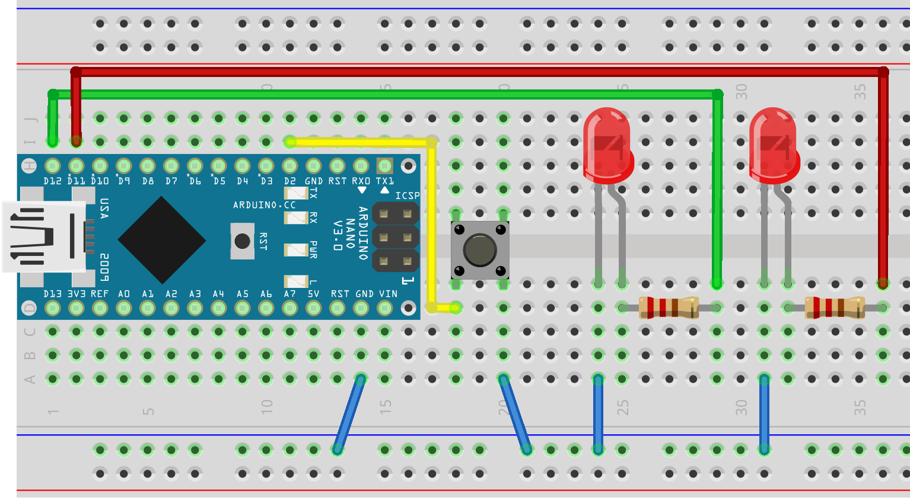

In the lecture parts of microcontrollers we got introduced to the Arduino-Ecosystem of boards and shields. Then we learned about board features, as well as the Arduino IDE and the basics of Serial Communication.

# **Lab**

In the lab part we then experimented hands-on with microctontrollers and different sensors, to get a feeling for everything.

## **Week 1: Controlling LEDs with a Hall-Sensor and a LDR-Sensor, PlatformIO**

In the first lab I tried some different sensors by controlling the LED-state with them and switched from the Arduino IDE to PlatformIO, a Visual Studio Code extension for working with Arduino, as well as ESP-Boards.

**Hall- and LDR-Sensor:**

A Hall-Sensor reacts to a megnetic field which then can be read by a microcontroller. The LDR-Sensor works similar only that it reacts to a change of brightness instead to a magnetic field.

Circuit:


Resistors for the LEDs: 220 ohm <br>
Resistor for the Hall-Sensor: 10k ohm

Code:

``` C++
#define PIN_HALL_SENSOR 14 //Hall-Sensor
#define PIN_LED1 12

#define PIN_PHOTO_RESISTOR A0 //LDR-Sensor
#define PIN_LED2 13

int brightness = 0;

void setup()
{
    pinMode(PIN_HALL_SENSOR, INPUT);
    pinMode(PIN_LED1, OUTPUT);
    pinMode(PIN_LED2, OUTPUT);
    Serial.begin(9600);

}

void loop()
{
    //Set LED to read value of LDR-Sensor
    digitalWrite(PIN_LED1, digitalRead(PIN_HALL_SENSOR));
    brightness = analogRead(PIN_PHOTO_RESISTOR);
    
    Serial.println("Hall: ");
    Serial.println(digitalRead(PIN_HALL_SENSOR));

    Serial.println("LDR: ");
    Serial.println(brightness);

    if (brightness < 600)
    {
      digitalWrite(PIN_LED2, HIGH);
    } else 
    {
      digitalWrite(PIN_LED2, LOW);
    }   
}
```
<br>
Magnet on Hall-Sensor (LED1 is turned off), LDR-Sensor in room-light (LED2 is turned off).


<br>
Hall-Sensor without magnet (LED1 is turned on), LDR-Sensor covered (LED2 is turned on)


## **Week 2: Wifi, Servo-Motor controlled via the Blynk-App**

First I turned on and off a LED over WIFI with a D1 Mini and after that I tried the Blynk App to controll a servo over my phone, you can see the code below.

Code:

``` C++
#define BLYNK_TEMPLATE_ID "xxx"
#define BLYNK_DEVICE_NAME "xxx"
#define BLYNK_AUTH_TOKEN "xxx"

#define BLYNK_PRINT Serial

#include <ESP8266WiFi.h>
#include <BlynkSimpleEsp8266.h>
#include <Servo.h>

Servo servo1;

char auth[] = BLYNK_AUTH_TOKEN;

// Your WiFi credentials.
// Set password to "" for open networks.
char ssid[] = "";
char pass[] = "";

BlynkTimer timer;
// This function is called every time the Virtual Pin 0 state changes
BLYNK_WRITE(V0)
{
// Set incoming value from pin V0 to a variable
  int value = param.asInt();
  Serial.println(value);
  if (value == 1)
  {
    servo1.write(-90);
  } else {
    servo1.write(90);
  }
  
  // Update state
  Blynk.virtualWrite(V1, value);
}
// This function is called every time the device is connected to the Blynk.Cloud
BLYNK_CONNECTED()
{
  // Change Web Link Button message to "Congratulations!"
  Blynk.setProperty(V3, "offImageUrl", "https://static-image.nyc3.cdn.digitaloceanspaces.com/general/fte/congratulations.png");
  Blynk.setProperty(V3, "onImageUrl",  "https://static-image.nyc3.cdn.digitaloceanspaces.com/general/fte/congratulations_pressed.png");
  Blynk.setProperty(V3, "url", "https://docs.blynk.io/en/getting-started/what-do-i-need-to-blynk/how-quickstart-device-was-made");
}
// This function sends Arduino's uptime every second to Virtual Pin 2.
void myTimerEvent()
{
  // You can send any value at any time.
  // Please don't send more that 10 values per second.
  Blynk.virtualWrite(V2, millis() / 1000);
}
void setup()
{
  // Debug console
  servo1.attach(D6);
  Serial.begin(9600);
  Blynk.begin(auth, ssid, pass);
  // You can also specify server:
  //Blynk.begin(auth, ssid, pass, "blynk.cloud", 80);
  //Blynk.begin(auth, ssid, pass, IPAddress(192,168,1,100), 8080);
  // Setup a function to be called every second
  timer.setInterval(1000L, myTimerEvent);
}
void loop()
{
  Blynk.run();
  timer.run();
  // You can inject your own code or combine it with other sketches.
  // Check other examples on how to communicate with Blynk. Remember
  // to avoid delay() function!
}
```
Here you can see the circuit:


## **Week 3: External Interrupt**

In this week I tried external Interrupts, they are helpfull to monitor (user-)input and react to them. The Interrupt Service Routine (ISR) is a callback function with 4 modes:
 - Low: Interrupt is triggered if pin is low
 - Change: Interrupt is triggered if pin state changes
 - Rising: Interrupt is triggered if pin switches from low to high
 - Falling: Interrupt is triggered if pin switches from high to low 
 - High: Interrupt is triggered if pin is high

 My idea of using external interrupts was to have two LEDs, of whom one is green and shows that everything works OK and the other one is red and starts blinking if there is a problem.
 In my case the "problem" gets triggered by a button, after which the green LED turns of and the red one start blinking. If the button gets pressed again the problem is "solved", the red LED truns off and the green one is on again.

 Here you can see the code, I used the "change"- mode for the ISR:

``` C++
const int ledPin1 = 12; //Grüne LED
const int ledPin2 = 11; //Rote LED
const int buttonPin = 2; //Interrupt Button
int x=0, y=0; //Variablen zum Hochzählen
int ledToggle1 = HIGH; //Zustand Grüne LED
int ledToggle2 = LOW; // Zustand Rote LED für Interrupt

//Variablen um timing der Interrupts festzustellen
unsigned long button_time = 0;      
unsigned long last_button_time = 0;

int ledState = LOW; //Zustand Rote LED für Blinken

//Variable zum Blinken der Roten LED
unsigned long previousMillis = 0;

const long interval = 250; //Blink delay der Roten LED

void button_ISR(){
    button_time = millis();
    //check to see if increment() was called in the last 250 milliseconds
    if (button_time - last_button_time > 250){
        Serial.print("Interrupt ");
        Serial.print(y++);
        Serial.println();
        ledToggle1 = !ledToggle1;
        digitalWrite(ledPin1, ledToggle1);
        ledToggle2 = !ledToggle2;
        digitalWrite(ledPin2, ledToggle2);
        last_button_time = button_time;
    }
}

void setup() {
    pinMode(ledPin1, OUTPUT);
    pinMode(ledPin2, OUTPUT);
    pinMode(buttonPin, INPUT_PULLUP);
    Serial.begin(9600);
    attachInterrupt(digitalPinToInterrupt(buttonPin), button_ISR, CHANGE);

    digitalWrite(ledPin1, HIGH);
}

void loop(){
    Serial.print("loop " );
    Serial.print(x++ );
    Serial.println();

    unsigned long currentMillis = millis();

    if (y%2==1){
        if (currentMillis - previousMillis >= interval) {
        // save the last time you blinked the LED
        previousMillis = currentMillis;

        // if the LED is off turn it on and vice-versa:
        if (ledState == LOW) {
        ledState = HIGH;
        } else {
        ledState = LOW;
        }

        // set the LED with the ledState of the variable:
        digitalWrite(ledPin2, ledState);
        }
    }
}
```

Circuit:



Here you can see everything in action:

