## Project pitch

We started the second semester with a presentation about the pitch of the project we planned to tackle for the second semester.

The Problem I wanted to solve is communication between bars and finances at Uni-Partys.

Currently DECTs are used to communicate on uni-partys. DECTs are basically old button cellphones, which allow you to call someone, write messages and thats about it.
The main things you want to communicate to others (bars or finances in specific) is to ask for change, that you need helpers or a refill of clean glasses.

The problem with talking over DECTs is that because of the music its hard to understand each other. 
The number of DECTs we have available is also limited, which results in only two persons per bar actually having a DECT.

So my idea was to create small bar-terminals which can be located in all the cashboxes behind bars at uni-partys to communicate between each other.

The terminals are supposed to:
 - be scaleable (as many terminals as you want per bar, as many bars as you want)
 - have predefined messages from which the user can select one and send it to a specific selected bar
 - have a button to send messages to finances
 - have a screen to show messages

On top of that it also would be nice if the send messages to finances could be shown on a website so that finances can open this site on their laptop to read the messages.

The last problem is that the wifi-access-point can be overloaded due to the high amount of people (1500) on a small space.
Because of this I decided to use a 433mHz radio signal to communicate between the bars and implement everything as a mesh-network to bridge longer distances between bars.

## Timeline

From the Pitch till the presentation of our project at the ["Streiflicht"](https://www.uni-ulm.de/in/mi/streiflicht) at Ulm University we had 7 Weeks (17.05.23 - 05.07.23).

I set myself the following timeline and milestones:
 - First two weeks (17.05.23 - 29.05.23):
   
   Research on mesh-networks, radio-signals and radio-modules for arduino, because I barely had any knowledge about any of those topics.
 - As soon as my ordered parts would arrive my plan was to put everything together on a breadboard and start programming.
 - Milestone 1 till the 11.06.23:
   
   Have a working system on a breadboard
 - After that my plan was create a housing with the buttons and solder everything together.
 - Milestone 2 till the 25.06.23:
   
   First version of the project is finished and ready to be presented
 - Till the 05.07.23: 
   
   Improve small things if necesary

### First weeks until the 12.06.23

Contrary to my timeline I spend more time into research about mesh networks and radio modules.
On top of that my order of the radio modules got lost as well, which set me back a little.

In my pitch I also got some tips for other ways to communicate between the terminals like using the already existing DECT-Network or LoRaWan, so I reserched about them as well and asked a lecturer for further information.

As soon as the two radio modules I ordered arrived, I tested both of them about general usability and functionality as well as the range of the radio signal:
 - The NRF24L01-module:

   The older of the two modules need 7 pins to connect to an arduino, uses 2,4 GHz, the range is not that good, theres more documentation in the internet for this one

 - HC-12-moduel:

   Newer, needs only 4 pins to connect to an arduino, uses 433 MHz, range was better in my tests and it seemed more intuitive to use for me.

So I decided to use radio modules and choose the HC-12 module over the NRF24L01+PA+LNA-module.
The main reasons were longer range, fewer pins to connect, which would make soldering a lot easier later and that it seemed more intuitive to use for me.

| 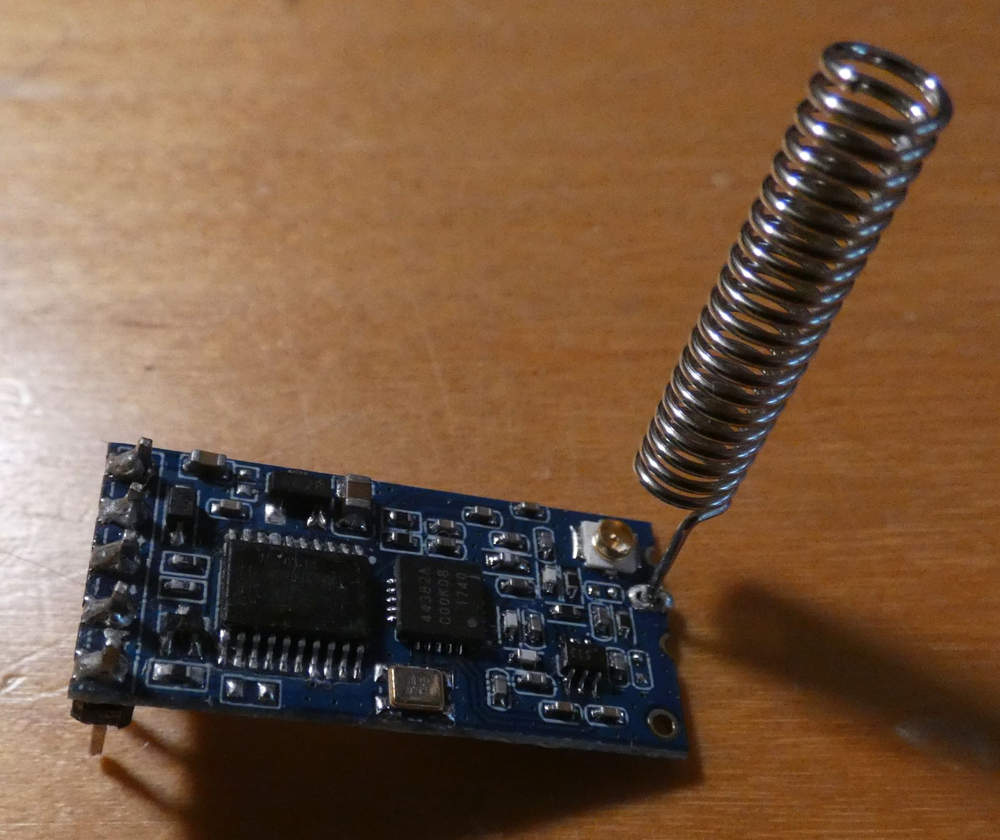 | 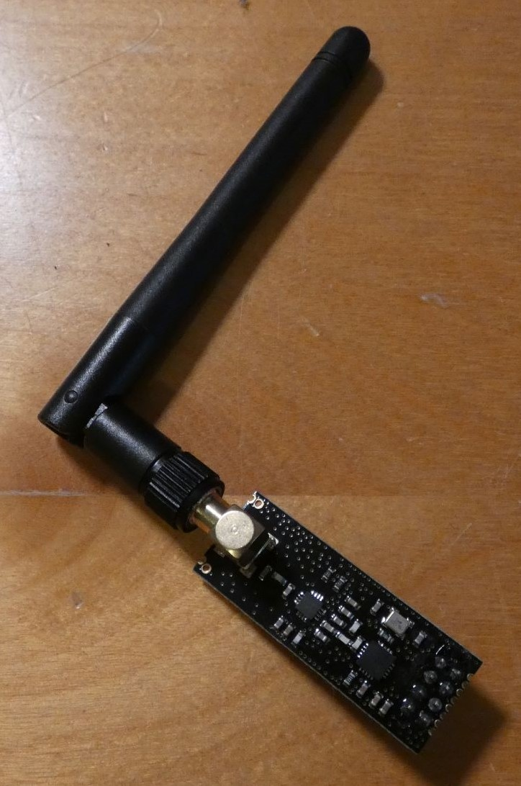 |
| :-: | :-: |
| *HC-12* | *NRF24L01+PA+LNA* |

I also ordered rotary encoders and oled-displays to use for the view and control of my terminal.

Unfortunately I did not reached the goal of my first milestone, because I just had decided for a radio module.

### 12.06. - 20.06

In this week I focused on the view and control of my bar-terminal.

To show the user all the necessary Information i used a 128x64 pixel oled.
For manipulation of the oled like selecting a message, selecting a bar and sending it to that bar I used a rotary encoder.

I researched a lot about menues with rotary encoders and which library to use to create a menue, but everything I could find surpassed my needs and was extremely complex for just a simple menue so I decided to implement a menue myself. A lot of libraries also nearly completely filled the ram of an arduino which was bad if you want to implement more stuff besides the menue.

| 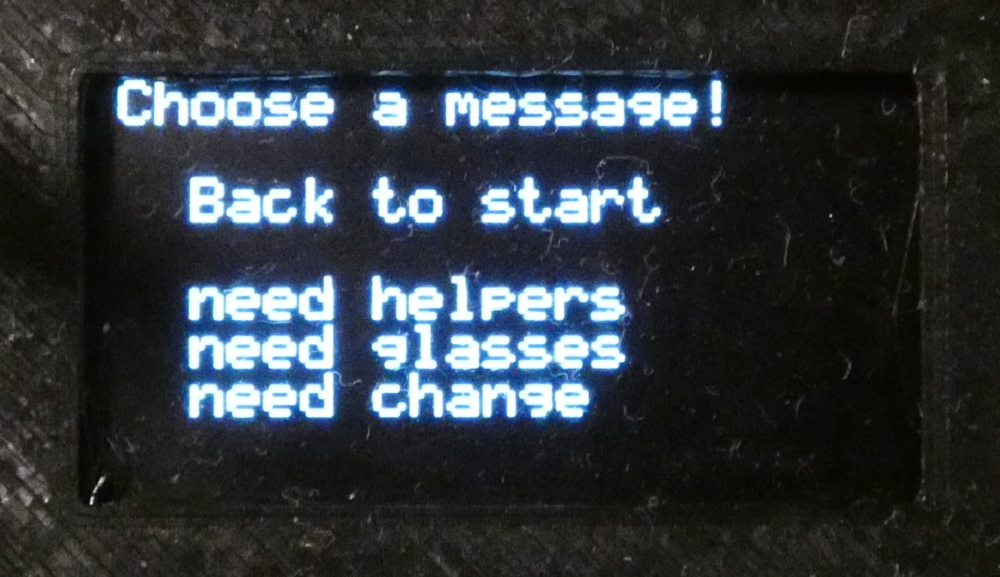 |
| :-: |
| *oled with menue* |

I'm pretty proud of the result so I'm planning to put it on Instructables or a similar site so other people can use it as well.

I used the SSD1306Ascii-library made bei greiman which is pretty resourcefull and not overloaded.

### 20.06. - 26.06.

In this week I connected my radio modules with the oled and rotary encoder with my menue.

I basically reached Milestone 1 in this week because I had a finished prototype on a breadboard.

It was now possible to select a messages, a bar which is supposed to receive the message and send the message. The other Terminal then was able to display the Message and from which bar it came.

When a message was send, every other terminal received it and decided based on the header, if the message was meant for itself or not.

If the message was meant for that terminal it displayed the message, otherwise the message got forwarded.

| 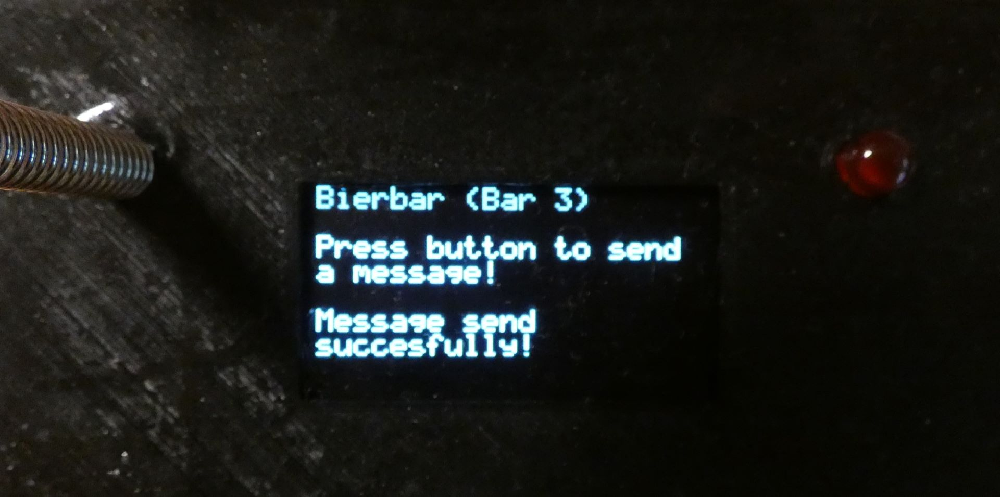 |  |
| :-: | :-: |
| *message send* | *message received* |

The header was build out of a string containing 3 numbers:
 - The first number indicated which message was send.
 - The second number indicated to which terminal the message was supposed to go.
 - The third number indicated from which terminal the message was send.

In this week I also organised the inlay of a cash register we use at uni-partys to take to measurements of one of the compartments which is supposed to hold the box of my terminal.
I also decided to add a LED to the Terminal, which indicates if a message is received.

After this week my plan was to finish milestone 2 but I only soldered one of the three terminals and the housing of the terminals was not yet printed.

### 26.06. - 03.07.

In this week I designed the housing of my terminals, made a test print if the housing would fit into the cash-register inlay.
I also made a test print for the cover of my housing, to see if my measurements for the led, antenna of the radio-module, oled-screen and rotary encoder would fit.

I also soldered the other two terminals and made some improvements in the code.

| 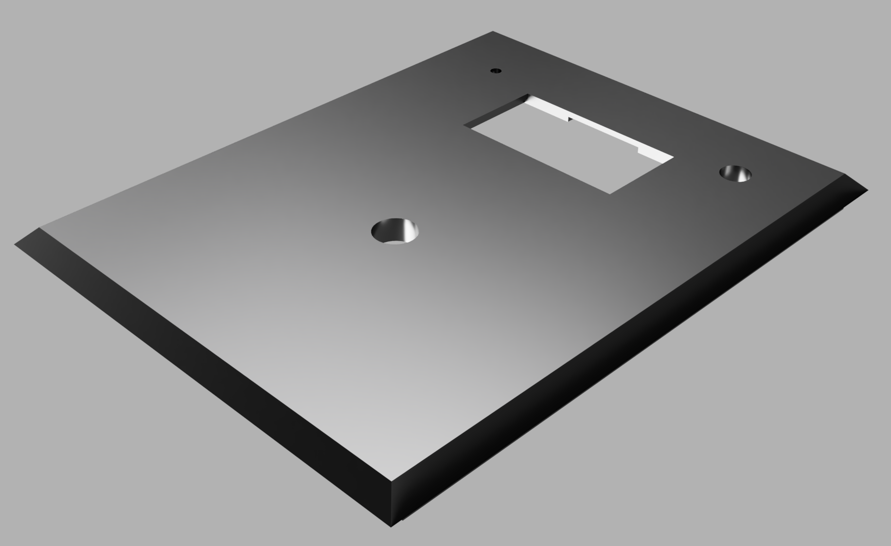 |
| :-: |
| *cover of my housing* |

### week of presentation until the 05.07.23

In the last days i finished printing the housings and covers for them.
I wanted to print a second revision for the covers, unfortunately the printer stopped working so I had to go with my first version in the presentation.

### Streiflicht on 05.07

At the [Streiflicht](https://www.uni-ulm.de/in/mi/streiflicht) the whole SwH group had a romm in which we presented our projects to interested guests.
There were also some lectures which were pretty interesting.
I really enjoyed the streiflicht and the interaction with interest people in my project were good.
We discussed about further improvements and the hardware I used for my project.

| 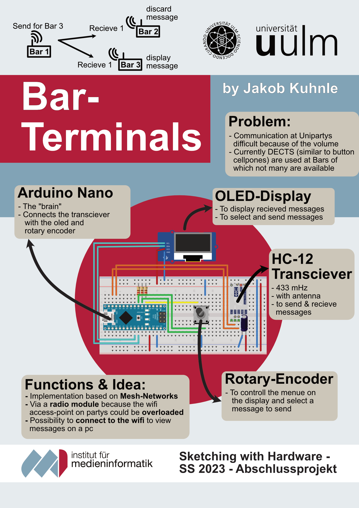 |
| :-: |
| *poster streiflicht* |

### Conclusion:

I was able to implement the key part of my project, the Terminal and being able to communicate between bars.

Unfortunately there was not enough time to also add a webpage for finances, so that they can receive the messages via they're laptop. 
On the other hand they can also just use a terminal to receive messages which works fine as well.
The idea for the webpage would have been to use a wemos d1 mini microcontroller to receive radio signals and log into wifi to submit the information to the webpage.

Another idea was to build a Button myself by using a compliant mechanism, but I also did not have enough time for that.

I spontaneously added an LED to show if something was received which is pretty helpful for usability in my opinion.

## Tools and methods

Compared to my exercise project this project was more on the software side, than the hardware side.
In my opinion that was pretty good because I'd say my weakness is more in programming than building stuff.
In general I would say I prefer production with a 3D-printer, and laser-cutting as well as the mechanics part of it like making the steering system for my exercise project more than programming, but thorugh this project programming also got more interesting.

For programming I used visual-studio-code with platform.io, a arduino extention which is way better than the standard arduino IDE. I really enjoyed working with it, because managing librarys is a lot easeier as well as working with more than one arduino (3 terminals) at the same time because you can specify upload ports.
Syntax highlighting is another big plus for platform.io.

To produce the housing and cover for it I only worked with 3D-printers. In the end one printer stopped working, which was unlucky but other than that I had no problems and really enjoyed working with all the printers in the lab.

To attach the LED, oled-screen and radio-module to the cover I used hot glue which didn't cause any problems either.
The rotary encoder got attached by the included screw.

For soldering I used the soldering-irons in the lab and my soldering-iron at home and the band saw in the lab to cut the breadboards to size. With the tools in the lab I did not have any problems, for the soldering-iron at home of which the temperature can't be adjusted I learned that pointy soldering tips are bad compared to tips with a wide tip because the heat gets ditributed differently.

## Motivation and feedback for future semesters

I think the most of my motivation for the module came through my existing interests in microcontrolles and building stuff (from lego models to the desk for my pc with screen holders and builtin buttons).
The lab with all the accessible tools, machines and other useful stuff was another big motivation, because the possibilities get a lot bigger than with the tools I have at home.
At last our main lecturer and also the other lecturers motivated me because if I had questions or problems they always could help me and in general had a lot of helpful input.

I think for the future I generally gained a deeper knowledge about working with microcontrollers, 3D-printers, laser cutters and about the posiblities that you have with those tools, also the projects of fellow students helped with getting inspirations for future projects I want to do myself.

The two main things I learned thorugh my project for the second semester is that even something that seems impossible, because of missing knowledge about the topic and resulting out of that the inability to assess if you will manage to do the project, that it is still possible.
When pitching the project I was very insecure about the possibility of me finishing the project, but in the end it worked and I learned a lot of new interesting stuff about microcontrollers, radio-signals and -modules. For the first time I also understood the basics of Networks which definitely will help me a lot for my further informatic studies.

In general I am happy with how the module is structured and I also think the topics we got introduced to were helpfull. The only thing I would recommend for future semsesters would be more time for the main project in the second semester. Maybe pitch the project at the end of the first semester so that you have the whole lecture free time and the summer semester for the project.
The last thing I would note is, that it was quiet hard to find a project that solves a problem or is unique beacuse these days you can find almost everything in the internet and I think maybe just a new approch to an already existing project is also challanging enough, because I spend a lot of time thinking about a real problem I want to solve that isn't already solved.

## Final Project

### Summary of my plan

My initial idea was to create something that allows bars to communicate with finances to signalise them when they need a refill of change or when the chash registers are getting to full and need to be emptied.

Out of this came the project of creating bar terminals, that allow the bars at uni-partys to communicate with each other by sending and beeing able to receive predefined messages.

### Final status of my project - features

#### Features in short:
 - Size fitting to the inlays of cash registers so that it can be placed securely behind a bar.
 - Oled-screen to show the menue to select messages to be send and to show received messages
 - LED to better highlite if a message has been received
   | 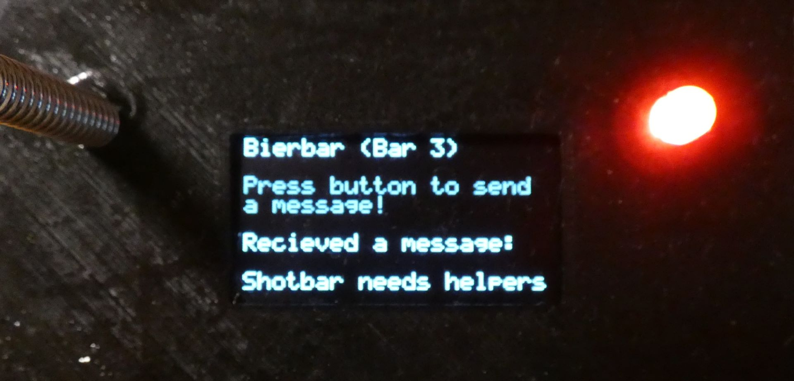 |
   | :-: |
   | *recieved message* |
 - Rotary encoder to use the menue shown on the screen, select a message, a bar for which the message is meant and finally send it.
   | 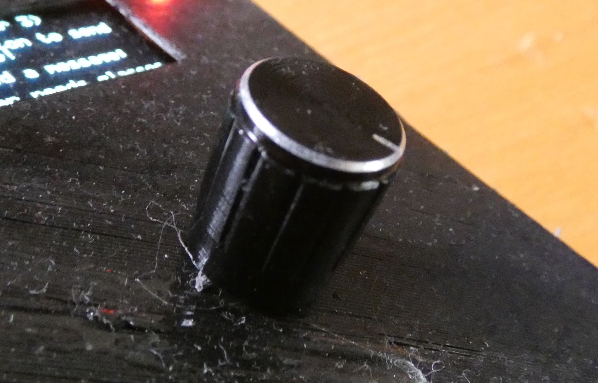 |
   | :-: |
   | *rotary encoder* |
 - Power supplied by a 9V-Battery so there is no need for an external power source

#### Features explained

The "brain" of the bar-terminal is an arduino nano, basically a mini-cpu.
Connected to the aruino is a screen as view for the user, a rotary encoder as controller, a LED as another indicator for the user as well a radio module to send and recieve messages.

**Menue on the oled-screen with rotary encoder and LED:**
   
The terminal can be controlled by a user by using the rotary-encoder. The user can see his or her manipulations by the rotary-encoder on the oled-screen.

Standard the oled screen shows a main-screen of my implemented menue.

| 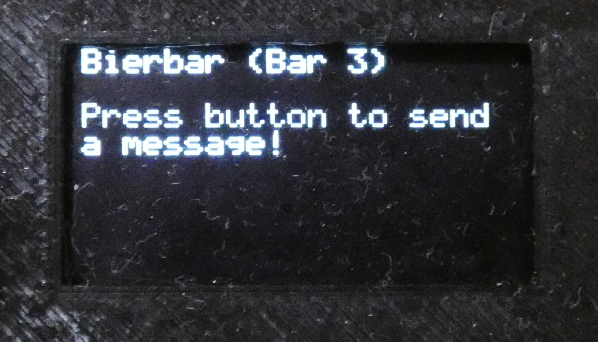 |
| :-: |
| *main menue* |

By pressing the rotary encoder the oled shows the screen which shows all the prefedined message for the user to select one.

| 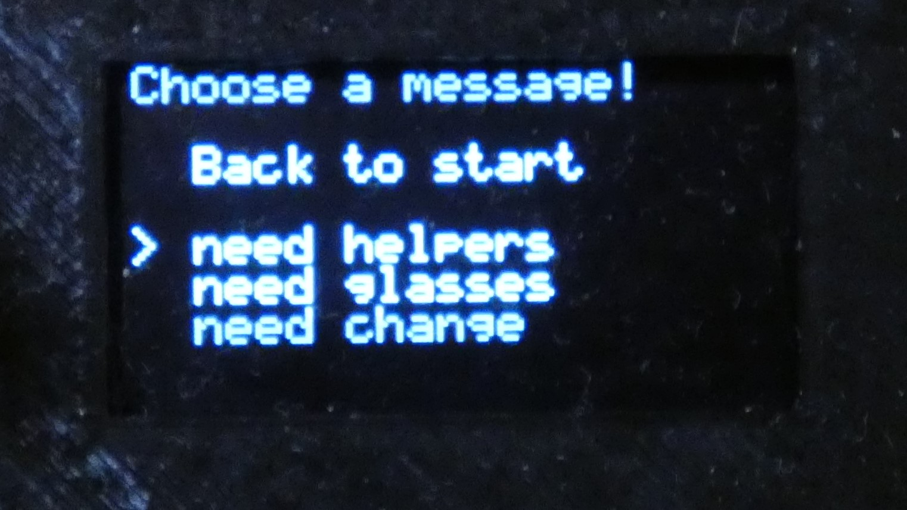 |
| :-: |
| *message menue* |

The message can be selected by turning the rotary encoder in either direction. A selected message is marked with this symbol: ">".

There is also an option for the user to return out of the message-selection-screen back to the start screen.

| 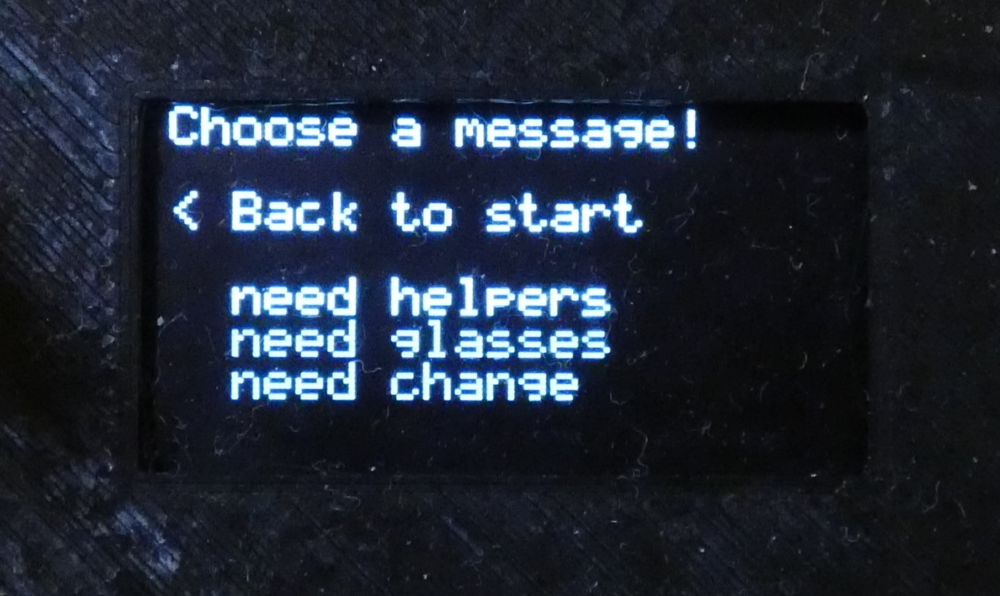 |
| :-: |
| *back option* |

As said, a message is selected by the ">"-symbol.
To continue with selecting a bar the user has to press the rotary encoder again.

The next screen, to select a bar to which the message is supposed to be send, is quiet similar to the screen for selecting a message.

| 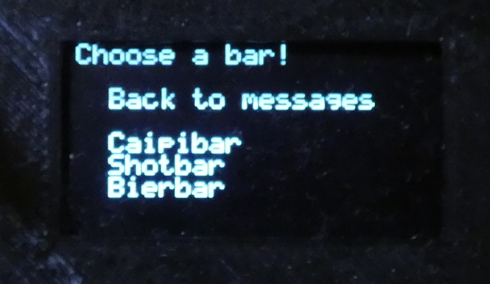 |
| :-: |
| *bar menue* |

Again, a bar is selected by turning the rotary encoder in either direction and by pressing the rotary encoder the message selected by the ">"-symbol gets send.

After sending the message you automatically return to the main screen which informs the user that the message has been send.

|  |
| :-: |
| *message send* |

A terminal can only receive a message if the main-screen is active. That means that while selecting a message and bar, the terminal can't receive messages.

If a message is received the LED turns on and the message gets displayed on the main menue.

|  |
| :-: |
| *message received* |

The LED can be turned of by pressing the rotary encoder once, then also the received message dissapears.

**Sending and receiving messages:**

Sending and receiving messages works because of the radio-module.

It communicates over 433mHz radio signals with the other radio-modules in other terminals.

This allows the terminals to work completely independent.
Which is usefull on partys because the wifi access-point as well as mobile networks are often overloaded.

Sending and receiving is implemented as a simplified "mesh-network".
This means that if a terminal sends a message **every** terminal in signal reach will recieve the message.

The message consists of four letters that are numbers:
 - First number: Indicates to which terminal the message is supposed to be send.
 - Second number: Indicates from which terminal the message has been send
 - Third number: Indicates which message has been send.
 - Fourth number: To help prevent loops caused by forwarding aka "forwarding-bit".

If a terminal receives a message, it first checks if the message is meant for this terminal by reading the first number, if the number matches the number of this terminal it will display the message on the oled-screen and turn on the LED.

If the message is **not** meant for this terminal, the message gets forwarded and the last number is safed so that the message can't be forwarded again.
Forwarding basically just means that the message gets resend to evey terminal in range, a terminal forwards a message just **once**.

Forwarding allows to "bridge" between two or more terminals which increases the distance between terminals over the possible range of the radio signal.

TODO-VIDEO

### Improvements

The only function that worked not as well on my presentation on streiflicht was that forwarding sometimes created loops.
I thought I had solved it but there still were some errors, but they now should be fixed.

Other than that everything worked out as I hoped, but there are still a lot of possible improvements:
 - Switch to turn of the battery
 - If a message is received, the length of the message can be checked to see if the message received completely.
   - with this feature included a **acknowledgement message** that gets send back to the original sender of the message would be usefull.

      This allows to signalise the sender of a message, if the message has been received or not or if the message is to short. This way the sender could resend the message if necesssary, because rigth now the sender assumes that the message will be received and if not the message is just lost.
 - I also thought of a wifi integration that allows for instance finances to receive the messages that are meant for them over a website. The reason for this is that finances on unipartys is located in a room further away from the party ground and able to use laptops, because the laptops are not as exposed to damage as behind a bar.