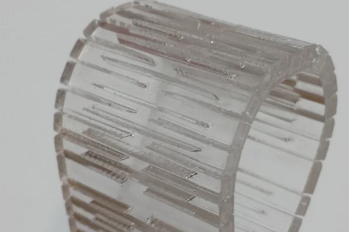
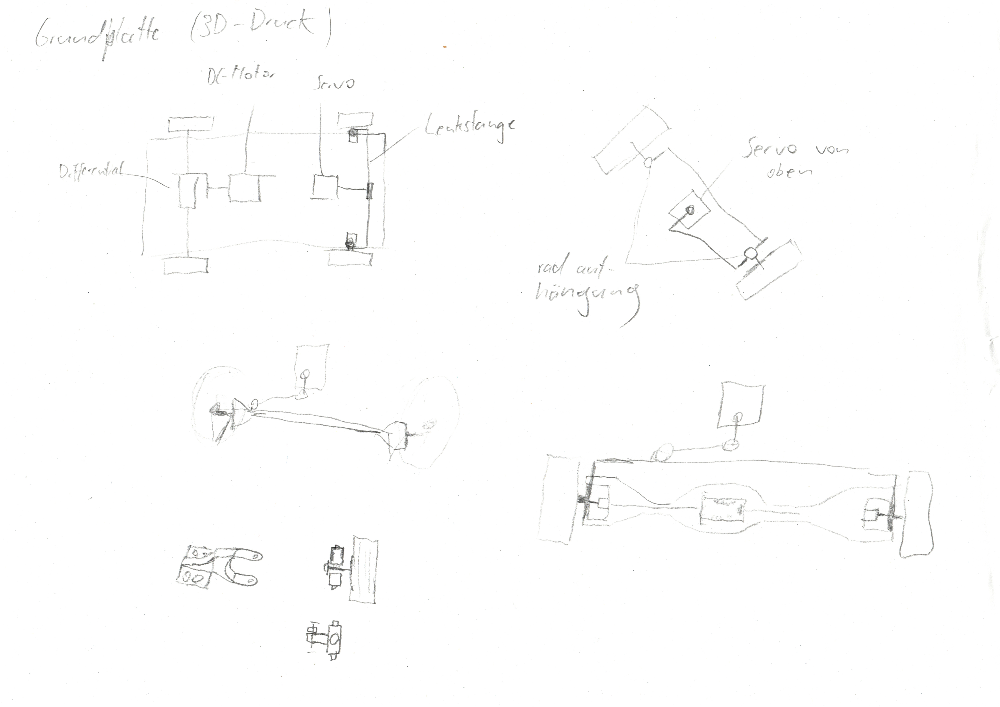
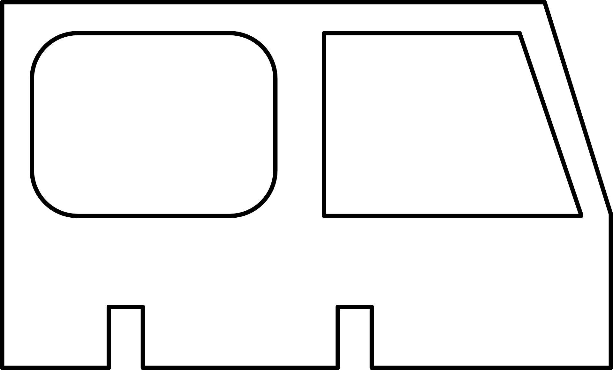

In the lecture part of subtractive manufacturing we first learned about vector graphics as well as G-Code which is used in a lot of computer guided machines like laser cutters, 3D-printers, etc.

Then we got an overview of tools to create svg's as well as 3D-models.

Next we learned about CNC milling and the basics about how it works.
We got an introduction into CNC mill bits and learned about problems you have to face with a CNC mill for exampel that it is impossible to make really small sharp inner corners because a mill bit is always round and that the thinness of a wall is limited due to vibration during milling.

After CNC milling we got an introduction to laser cutting and the laser cutter we have in our lab.
With a laser-cutter it is possible to cut, engrave as well as mark material. When cutting like it is when sawing wood, material gets removed, which has to be calculated when creating a sketch you want to cut.
When designing its usefull tu creat interlocking parts in order to make the final object more stable, its also possible to design bending structures for some really interesting shapes.

>Source: https://www.instructables.com/Curved-laser-bent-wood/

Lastly we learned about safety when working with laser-cutters as well as CNC-mills.

# Lab

In the Lab part we then made our first-hand experiences with laser cutting.

## Sketching

First we had to sketch our project and parts of it we could potentially cut/make with a laser-cutter.

**Sketch 1**

My plan is to build a rc-car, and the body of it I want to build out of laser-cutted pieces. The car is inspired by a Landrover Defender.

The the sketch in the top left corner consists of two pieces which overlapp in order to better glue them together.

In the bottom right corner you can see the same two pieces as in the top left corner with a system to connect them even more stable together.

**Sketch 2**

Here you can see the second part of my sketch which includes the chassis of my car with some trys on the steering system, everything you can see here has to be 3D-printed.

## Creating a svg

After sketching we went to a tool of our choice, in my case Affinity Designer and designed a small maximum 5x5cm svg to cut with the laser cutter.

I choosed the top siede-part of my car-body with the windows:

The two notches on the bottom are there to connect the part more secure and a test on how thick I have to make a notch in order to interlock it with other parts.
The thickness of the material is 3 mm, I went with a notch 2,8 mm wide which worked out perfectly in the end.

## Laser Cutting and Final Part
<>
The final svg then can be loaded into LightBurn.

It is important to choose which cuts have to be made first, in my case the windows, because if you cut the outer edge first the whole part would be loose and could slip while cutting the windows. The reason for this is that there is a ventilation system in the Laser-Cutter which vibrates a little.

Here you can see the cutted piece slotted into the two inner window pieces.

In LighBurn its also important to choose the settings for cutting a certain material.

In this case we used the preset for our material and modivied it so that the laser makes 3 rounds and also moves down around 1 mm after each round of cutting.